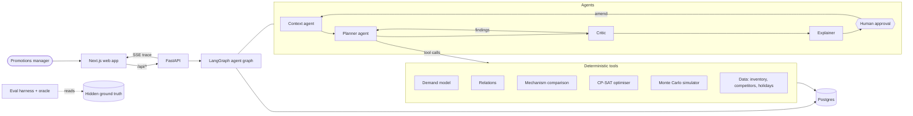

# PromoPilot

**An agentic promotion planner for retail.** A promotions manager writes a planning brief in plain English. PromoPilot turns it into a promotion plan per region: which products to promote, with which mechanism, how deep, for how long and for which customers. The plan respects the retailer's margin, stock and budget constraints. Every number comes from deterministic, tested tools, and nothing is final until the manager approves it.

Built for the ET AI Hackathon, Agentic Edition (Problem 3, Retail: Autonomous Promotion Planner). Our claim is **F3 × D2**: all nine features, with reliability we measure rather than assert.

**Links:** [Demo video](#demo-video) · [Architecture](docs/architecture.md) · [Nine-blocker claim and evidence](docs/nine-blocker.md) · [API reference](docs/api.md) · [Tool contracts](docs/tools.md) · [Decisions](docs/adr/README.md) · [Glossary](CONTEXT.md)

<!-- LATE: hero screenshot from #78 (docs/screenshots/), e.g. the session page with a plan -->

## What it does

Take the brief *"Plan Diwali promotions for Snacks and Beverages across North and West. Budget ₹8 lakh. Keep margin above 18%. We are overstocked on 400g namkeen packs — clear at least 60% of that stock. Target families."* PromoPilot handles it in five steps:

1. **Reads the brief.** The Context agent turns it into a structured planning request. It fills unstated values from data and company policy, and lists every assumption with its source and confidence. If the budget, scope or promo window is missing or unclear, it **asks** instead of guessing.
2. **Plans with tools.** The Planner agent decides which analyses to run: inventory, competitor prices, demand, product relationships, mechanism comparisons. It then has a CP-SAT optimiser choose the plan and a Monte Carlo simulator stress-test it.
3. **Checks its own work.** The Critic validates every hard constraint and reviews the risks: over-concentration, heavy cannibalisation and stock-out risk. It sends findings back to the Planner, at most three times.
4. **Explains the plan.** Each region's plan lines come with their mechanism, depth, duration, target segment and expected uplift, and a P10–P90 profit range. They also show cannibalisation and halo, competitor context, and a rationale whose every number is checked against the tool outputs.
5. **Waits for a human.** The manager approves, rejects with a reason, or amends mid-way ("Budget cut to ₹6 lakh", "Drop West"). An amendment gives a new plan revision that says what changed and why. When the constraints cannot all be met, PromoPilot says so, names the binding constraints and proposes the smallest relaxation, which can be accepted in one click.

## Why

Retail promotions are planned in spreadsheets from gut feel and last year's calendar. A good plan must weigh many things at once:

- elasticity, cannibalisation and halo;
- stock and clearance;
- regional holidays;
- competitor prices;
- margins and a fixed budget, across hundreds of SKUs and several regions.

LLMs are good at reading intent and explaining trade-offs, but bad at arithmetic. PromoPilot therefore splits the work: **agents decide, tools compute, humans approve** ([ADR 0002](docs/adr/0002-agents-decide-tools-compute.md)).

## The claim: F3 × D2

- **F3.** All nine features of the problem statement:
  1. select products;
  2. choose the mechanism;
  3. optimise discount, duration and segment;
  4. cannibalisation;
  5. product relationships;
  6. inventory;
  7. regional plans;
  8. competitor awareness;
  9. simulation before launch.

  On top of these come the supporting features: a live agent trace and structured logs, one-click retraining, fault tolerance (retries, a fallback provider, degraded modes, replay), a human approval gate, and grounded explanations. Each feature's implementation is in [the architecture document](docs/architecture.md#feature-to-implementation).
- **D2.** The inputs are structured retail tables plus a free-text brief. Reliability is measured against the hidden ground truth of a synthetic retailer: an oracle scores every plan on the true demand, over 33 scenarios (SPEC §12.1's 32 in nine groups, plus one more amendment). The metrics cover constraint satisfaction, plan quality against a rule-based baseline, regret against the best plan, extraction, clarification, infeasibility handling, grounding and model recovery. D3 (multimodal input) is not claimed.

The claim's justification, the evidence matrix and the final eval numbers are in **[docs/nine-blocker.md](docs/nine-blocker.md)**.

## Try it: `make demo`

You need Docker (Docker Desktop on Windows and macOS) and GNU make. No API key and no other tools are needed.

```bash
git clone https://github.com/asalwania/promopilot.git
cd promopilot
make demo
```

Open http://localhost:3000 when it prints `PromoPilot is ready`. `make demo` does four things:

- builds the images;
- generates the seed-42 synthetic world and loads it into Postgres;
- trains and registers the models;
- starts the API and the web app.

<!-- LATE: first-start time after #113 -->The first start takes about 5 minutes on a CI-class machine, and 5–10 minutes on a laptop's first Docker build. Later starts reuse the data and models and take well under a minute ([ADR 0073](docs/adr/0073-make-demo-from-a-fresh-clone.md)).

On Windows, run `make` from **Git Bash**. Without make, for example in PowerShell, start the same stack with `docker compose --profile demo up --build`.

**What to try.**

- **The example briefs.** The home page offers four, and each replays a recorded session with no API key: plan, amend, answer a question, approve. The **Demo mode** badge says so.
- **A brief of your own.** It still plans, but without the language model: rules read the brief, the default sequence plans and a template explains. A note says so.
- **Live planning.** Put `OPENAI_API_KEY` (or `ANTHROPIC_API_KEY`) in `.env`, copied from `.env.example`, and run `make demo` again. It then plans any brief live.

**The pages.**

- A **session page** shows:
  - the live agent trace;
  - the assumptions;
  - a tab per region, with a mechanism drawer per plan line;
  - the constraint checklist, not-selected options and competitor prices;
  - the simulation band chart, with **Re-simulate**;
  - the revision diff, the audit trail, and the approve, reject and amend actions.
- **`/evals`** shows the recorded full eval report.
- **`/models`** lists the model registry and retrains.
- **`/data`** explores the synthetic data.

To stop, run `make demo-down`, which keeps the data. To start over, run `make demo-reset`. For a port already in use, set `WEB_PORT`, `API_PORT` or `POSTGRES_PORT` in `.env`. The full guide is in [docs/guide/running.md](docs/guide/running.md).

## Develop

You need Docker, [uv](https://docs.astral.sh/uv/), Node 24 with [pnpm](https://pnpm.io/) 11, and GNU make (Git Bash on Windows).

```bash
make setup   # .env from .env.example, backend and frontend dependencies, git hooks
make data    # the seed-42 synthetic world into data/ and Postgres
make train   # fit and register the demand and relations models
make dev     # Postgres in Docker; API on :8000 and web on :3000 with hot reload
```

Tests never call a real LLM. They use `FakeProvider` or the recorded cassettes, and live checks are marked `live` and excluded by default. Follow [CLAUDE.md](CLAUDE.md) for the working rules and [CONTEXT.md](CONTEXT.md) for the vocabulary.

## Architecture



- **Backend.** Python 3.12, FastAPI, LangGraph with a Postgres checkpointer, LightGBM and statsmodels, OR-Tools CP-SAT, NumPy.
- **Frontend.** Next.js, TypeScript, Tailwind CSS, shadcn/ui, TanStack Query and Recharts.
- **LLM.** OpenAI `gpt-4.1-mini` or Anthropic `claude-sonnet-5`, each the other's fallback, or replay with no key.

[docs/architecture.md](docs/architecture.md) covers the rest: the process flow, the agent graph as built, the tool contracts, model usage, the feature-to-implementation table and the evidence for the claim.

## Commands

| Command | What it does |
|---|---|
| `make demo` / `make demo-down` / `make demo-reset` | The one-command demo in Docker, with no API key; stop it keeping its data; or delete its data |
| `make setup` | Install dependencies and pre-commit hooks |
| `make dev` | Postgres in Docker; API and web natively with hot reload |
| `make up` / `make down` | The full stack in Docker, replaying the recordings |
| `make data` | Generate the seeded synthetic world and its hidden ground truth, and load Postgres |
| `make train` | Fit and register the demand and relations models (`make data` first) |
| `make test` | Backend and frontend unit and API tests (no Docker, no LLM), with the 85% core coverage gate |
| `make test-integration` | Backend tests against a throwaway Postgres |
| `make test-e2e` | Playwright journeys against a running stack |
| `make lint` / `make format` / `make typecheck` | ruff, ESLint and Prettier; mypy strict and tsc strict |
| `make eval` | Play the 33 eval scenarios and write the report (`ONLY=`, `SMOKE=1`, `RUNS=`, `SEED=`) |
| `make eval-smoke` | What CI runs: replay the five smoke scenarios with no key |
| `make record-cassettes` / `make check-cassettes` | Record the demo sessions' LLM calls with a live key; replay them with none |
| `make record-eval-cassettes` | Record the eval scenarios' LLM calls with a live key (costs money) |
| `make api-types` | Export OpenAPI, regenerate the frontend types, [docs/api.md](docs/api.md) and [docs/tools.md](docs/tools.md) |
| `make api-docs` / `make tool-docs` | Regenerate only the API reference, or only the tool contracts |

`make help` lists every target.

## API

`POST /api/sessions` starts a planning session from a brief. The session then moves through clarify, amend, approve and reject, and its trace streams from `GET /api/sessions/{id}/events` as Server-Sent Events. Catalogue, inventory, competitor, relations, models and eval endpoints serve the pages.

- **[docs/api.md](docs/api.md)** is the full reference, generated from the OpenAPI contract. CI fails when it drifts.
- **Interactive docs** are at http://localhost:8000/docs while the API runs.
- **Errors, limits, timeouts and rate limits** are explained in [docs/guide/api-usage.md](docs/guide/api-usage.md).

## Evals

```bash
make eval            # every scenario once, into backend/evals/reports/ (no Docker, make data or make train needed)
make eval RUNS=5     # five runs each, for the consistency metric
make eval-smoke      # the CI smoke subset, replayed with no key
```

The eval builds its own seeded world with the hidden ground truth. It fits the models as of each scenario's week and plays every scenario through the full agent graph. It then scores each final plan with the oracle, against the rule-based baseline and against the best plan made on the true parameters.

- **Output.** The report lands as JSON and Markdown in `backend/evals/reports/`, and `/evals` shows the latest.
- **Replay.** With no key, the scenarios replay their recorded LLM calls.

The scenarios, metrics and targets are explained in [docs/guide/evals.md](docs/guide/evals.md). The latest numbers are in [docs/nine-blocker.md](docs/nine-blocker.md).

## Results

<!-- LATE: headline eval numbers. Fill every value from the final published run (backend/evals/published/latest.md), and Consistency from the RUNS=5 run. Copy them as the report states them, with its timestamp, and keep them equal to docs/nine-blocker.md. The targets are SPEC §12.2's. -->

| Metric | Result | Target |
|---|---|---|
| Plans beating the rule-based baseline | _pending_ | ≥ 90% |
| Final plans passing every hard constraint | _pending_ | 100% |
| Grounding: explanation numbers traced to a tool output | _pending_ | ≥ 98% |
| Regret, median against the best plan | _pending_ | ≤ 10% |
| Consistency: the same SKUs chosen across runs | _pending_ | ≥ 90% |

Every number is from one report, with the run's timestamp: _pending_. How each is measured, and the verdict on the claim, are in [docs/nine-blocker.md](docs/nine-blocker.md).

## Known gaps

These are open issues, listed so no one has to find them. Each is a gap in speed, quality or reporting, and final plans are still validated against every hard constraint. They are tracked on [GitHub](https://github.com/asalwania/promopilot/issues).

- **Optimiser time on large scopes ([#166](https://github.com/asalwania/promopilot/issues/166)).** The main solve's 10 deterministic seconds take 52–105 s of wall time on the largest scopes, past the 60 s safety net, so the plan can stop as feasible rather than proven optimal.
- **Slow binding analysis ([#168](https://github.com/asalwania/promopilot/issues/168)).** The re-solves that name the binding constraints run one after another, which adds about 30 s to a planner attempt on a loaded machine. They could run concurrently.
- **Regret from model error ([#170](https://github.com/asalwania/promopilot/issues/170)).** Model error is the largest cause of the regret left. The optimiser does not yet shrink its objective for estimation uncertainty.
- **Regret by cause on `/evals` ([#171](https://github.com/asalwania/promopilot/issues/171)).** The report and its Markdown show the split into model error, planner choices and timeouts. The dashboard does not yet.
- **Clearance asks by SKU id ([#174](https://github.com/asalwania/promopilot/issues/174)).** A free-text clearance ask cannot name SKU ids, and when a brief makes several asks the first wins.
- **The Critic's tolerance ([#181](https://github.com/asalwania/promopilot/issues/181)).** The Critic keeps a risk-reducing attempt only within 5% of the best objective, so a per-SKU depth cap is often discarded and its finding stays open. The tolerance is to be tuned from the full eval.

<!-- LATE: check each gap above against its issue before submission; drop one that was closed and add any new one that still affects a result. -->

## Demo video

<!-- LATE: the demo video URL from #80. Replace this line with the link. -->The demo video link is added at submission.

## Documentation

| Document | What it holds |
|---|---|
| [docs/architecture.md](docs/architecture.md) | Process flow, agent graph, tool contracts, model usage, features → implementation, evidence |
| [docs/nine-blocker.md](docs/nine-blocker.md) | The F3 × D2 claim, its evidence matrix and the final eval numbers |
| [docs/guide/running.md](docs/guide/running.md) | The demo and Docker stacks, settings, LLM providers and recording cassettes, a tour of the web app |
| [docs/guide/planning.md](docs/guide/planning.md) | The synthetic data, the demand and relations models, promo options, the optimiser and the mechanism comparison, module by module |
| [docs/guide/api-usage.md](docs/guide/api-usage.md) | Endpoint behaviour, errors, limits, timeouts, rate limits, logging |
| [docs/guide/evals.md](docs/guide/evals.md) | Scenarios, metrics, the report and the CI smoke eval |
| [docs/api.md](docs/api.md) · [docs/tools.md](docs/tools.md) | Generated API reference and tool contracts |
| [docs/adr/README.md](docs/adr/README.md) | Every architecture decision record |
| [CONTEXT.md](CONTEXT.md) · [SPEC.md](SPEC.md) | The domain glossary and the original specification |

## Repository layout

```
backend/     FastAPI app and agents (src/promopilot), tests, eval scenarios and cassettes; uv project
frontend/    Next.js App Router app, Vitest unit tests, Playwright e2e
docs/        Architecture, nine-blocker claim, guides, generated API and tool docs, ADRs
data/        Generated by make data (gitignored): the synthetic world and its hidden ground truth
```

## Credits

PromoPilot's code was written for this hackathon. It builds on these open-source projects, each under its own licence:

- **Backend:**
  - FastAPI, Pydantic, SQLAlchemy and Alembic, uvicorn, structlog (MIT or BSD);
  - LangGraph (MIT);
  - Google OR-Tools (Apache-2.0);
  - LightGBM (MIT);
  - statsmodels, pandas, NumPy and PyArrow (BSD or Apache-2.0);
  - psycopg (LGPL-3.0) and asyncpg (Apache-2.0);
  - the OpenAI and Anthropic Python SDKs (Apache-2.0 or MIT);
  - PostgreSQL (PostgreSQL License).
- **Frontend:** Next.js and React, Tailwind CSS, shadcn/ui and Base UI, TanStack Query, Recharts, zod, lucide, openapi-typescript (MIT or ISC).
- **Tooling:** pytest and Hypothesis, Vitest and Testing Library, Playwright (Apache-2.0), ruff, mypy, ESLint and Prettier.

We worked spec-first and test-first with [Matt Pocock's agent skills](https://github.com/mattpocock/skills), and built the project with the help of [Claude Code](https://claude.com/claude-code). The synthetic data is generated by our own code, and no real retailer's data is used.

## Licence

[MIT](LICENSE)
