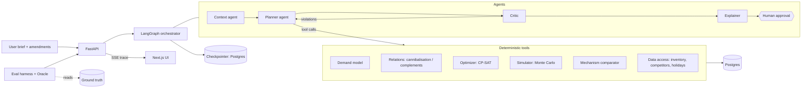

# SPEC.md — PromoPilot: Autonomous Promotion Planner

> **Kickoff spec for Claude Code.** Put this file at the repo root as `SPEC.md`. It is the single source of truth for what we are building, why, and in what order. Everything else (CONTEXT.md, ADRs, tickets, code) is derived from it.
>
> Project: ET AI Hackathon — Agentic Edition (Economic Times × Accenture), Phase 2 Build Sprint.
> Problem chosen: **Problem 3 — Retail: Autonomous Promotion Planner**.
> Target grid position: **F3 × D2**.
> Working name: **PromoPilot** (rename freely).

---

## 0. How Claude Code must use this spec

### 0.1 Workflow (spec-driven + TDD, using Matt Pocock's skills)

Install the skills once:

```bash
npx skills@latest add mattpocock/skills
# or, inside Claude Code:
/plugin install mattpocock-skills
```

Then follow this loop. Do not skip steps.

| Step | Skill | Output |
|---|---|---|
| 1. Configure repo conventions | `/setup-matt-pocock-skills` | `docs/agents/issue-tracker.md` (choose **GitHub Issues**), `docs/agents/domain.md`, "Agent skills" section in `CLAUDE.md` |
| 2. Build the domain model | `/grill-with-docs` | `CONTEXT.md` (glossary from §4 of this spec, sharpened), first ADRs in `docs/adr/` |
| 3. Write one spec per epic | `/to-spec` | One spec issue per epic in §15 (E0–E12) |
| 4. Break specs into tickets | `/to-tickets` | Tracer-bullet tickets with blocking edges, labelled by epic |
| 5. Build each ticket | `/implement` (drives `tdd` + `code-review`) | Red → green → refactor, one small PR per ticket |
| 6. Hard bugs | `diagnosing-bugs` | Reproduce → minimise → hypothesis → instrument → fix, with a regression test |
| 7. Mid-project health check (after E6 and after E9) | `/improve-codebase-architecture` | Refactor tickets |
| 8. Between sessions | `/handoff` | Handoff doc so the next session starts with full context |

Optional: `/wayfinder` to hold the whole multi-session plan as decision tickets.

### 0.2 Non-negotiable working rules

1. **Spec first, then test, then code.** No production code without a failing test that demands it.
2. **Vertical slices.** Every ticket delivers something runnable end to end or a complete, tested module behind a stable interface. No "scaffold everything first" tickets beyond E0.
3. **Tests never call a real LLM.** Use `FakeProvider` (scripted) or `ReplayProvider` (recorded cassettes). Live calls only in tests marked `@pytest.mark.live`, excluded by default.
4. **Agents and learned models never read ground truth.** `data/ground_truth/` is readable only by `promopilot.evals` and `promopilot.datagen`. Enforce with an import-boundary test (§13.4).
5. **The LLM never does arithmetic.** Every number shown to a user comes from a deterministic tool output. Enforced by the numeric-grounding check (§9.6).
6. **Determinism.** Every stochastic step takes an explicit seed. Same seed + same inputs = same outputs.
7. **Small, reviewable commits** using Conventional Commits (`feat:`, `fix:`, `test:`, `refactor:`, `docs:`, `chore:`).
8. **When the spec is ambiguous, stop and ask** (use the grilling flow). Do not invent requirements. Record decisions as ADRs.
9. **Judges must be able to run it without help.** Anything that breaks `make demo` on a fresh clone is a P0 bug.

---

## 1. Hackathon context (what we are judged on)

### 1.1 The 3×3 "9 blocker" grid

Every solution is placed on a grid of **Solution Features (F1–F3)** × **Solution Depth (D1–D3)**.

- **Depth** combines (a) how much input uncertainty or lack of structure the solution handles and (b) how reliable its output is.
- **Features** combines (a) the number of relevant, distinct features and (b) supporting features embedded in the solution (observability, trainability, fault tolerance, etc.).

Teams must **declare their self-estimated position and justify it** in the final submission. **There are penalties for both overestimation and underestimation.** Solutions that properly show greater coverage are rewarded.

### 1.2 Evaluation criteria (no weights published)

1. Significance and relevance
2. Innovation and originality
3. Effective use of AI (central, not bolted on)
4. Technical complexity and execution
5. Agentic / autonomous capability (reason, plan, use tools, take actions, recover from errors, appropriate autonomy)
6. Business / user impact
7. Prototype quality and usability
8. Scalability, Responsible AI and robustness (hallucination, security, privacy, bias, reliability, human oversight)

### 1.3 What the organisers expect in the final submission

- **A working demo** showing the solution working in every area where we claim it works.
- **A detailed structural architecture**: process flow, key actions, decisions, model usage, how key features are incorporated, and how it supports the claims shown in the demo.

### 1.4 Submission form fields (Unstop)

| Field | Requirement |
|---|---|
| Pitch deck | PDF, max 50 MB, recommended 8–12 slides: Team Introduction, Problem Statement, Proposed Solution, Architecture, AI Models & Technologies Used, Product Demo, Business Impact, Scalability, Future Roadmap |
| Demo video | 2–4 minutes; mp4 upload and a public YouTube (unlisted) or Google Drive link. Cover: Introduction, Problem Overview, Live Product Demonstration, AI Capabilities, Key Features, Business Impact, Closing Summary |
| GitHub repo | **Public.** Complete source, README.md, installation steps, dependencies, architecture overview, API documentation, environment setup. Judges must understand and run it without help |
| Problem statement | Dropdown: "Retail – Autonomous Promotion Planner" |

### 1.5 Rules that affect engineering

- Plagiarism = disqualification. Open-source tools and AI models are allowed. Write our own project code; credit anything reused in the README.
- One solution per team. Edits allowed until the deadline, none after.

---

## 2. Problem statement (Problem 3, as given by the organisers)

**Retail – Autonomous Promotion Planner**

Retail promotions are a key tool for all retail companies to sell their products. However, successful promotion strategies require complex optimisation, coordination, product and market understanding, and subjective judgements. Teams must account for these factors while balancing commercial objectives and operational constraints.

Develop an **agentic planner** capable of **extracting, or inferring with a high degree of confidence, all relevant input parameters** and **making decisions on the key dimensions of the promo strategy**. The planner should **adjust to dynamic requirements as it builds the strategy** and **satisfy all necessary and relevant constraints imposed by the parent company**.

**Inputs the agent receives:** Inventory · Competitor prices · Holidays · Margins · Customer segments

**Decisions it makes:** Which products to promote · Discount amount · Duration · Target audience

**Constraints the decisions must satisfy:** Minimum margin · Inventory clearance · Marketing budget

**Core desirable features (the F-axis list):**

1. Select which products to promote
2. Determine the promotion mechanism
3. Optimise the discount and customise other strategies
4. Understand cannibalisation
5. Understand product relationships
6. Consider inventory constraints
7. Geographically customise promotions
8. Competitor awareness
9. Simulate the promotion before launching

**Depth requirements:**

- **D1:** Mostly structured and textual data as input. Acceptable outputs in a majority of situations.
- **D2:** Mostly structured and textual data as input. High degree of demonstrable reliability.
- **D3:** Highly heterogeneous multimodal input. High degree of demonstrable reliability.

**Feature requirements:**

- **F1:** at least 2 features from the list
- **F2:** at least 5 features
- **F3:** at least 7 features

### 2.1 Our claim: F3 × D2

- **F3:** we implement **all 9** features (2 above the threshold as buffer), plus supporting features: observability (agent trace + structured logs), trainability (one-click retrain), fault tolerance (retries, fallback LLM, replay mode), human oversight (approval gate).
- **D2:** inputs are structured tables plus a free-text planning brief. Reliability is **measured, not asserted**, against hidden ground truth in a synthetic dataset (§12).
- **Not claiming D3.** Multimodal inputs (flyer images, PDFs) are out of scope and listed under Future Roadmap. If D2 targets are not met at the end, the justification doc must downgrade the claim to D1 honestly. The rule for "not met" is ADR 0089 D3: D2 holds when most targeted §12.2 metrics pass and constraint satisfaction, clarification, infeasibility handling and grounding each pass or miss only narrowly with a stated cause.

---

## 3. Product definition

### 3.1 Primary user

A **category / promotions manager** at a multi-region retailer who today plans promotions in spreadsheets using gut feel and last year's calendar.

### 3.2 Core user journey (the demo story)

1. User types a **brief** in plain English, e.g.
   *"Plan Diwali promotions for Snacks and Beverages across North and West. Budget ₹8 lakh. Keep margin above 18%. We are overstocked on 400g namkeen packs — clear at least 60% of that stock. Target families."*
2. **Context agent** turns the brief into a structured `PlanningRequest`, fills unstated parameters from data (e.g. promo window from the holiday calendar), and lists every assumption with a confidence score. If a critical field is missing or confidence is low, it **asks** instead of guessing.
3. **Planner agent** calls tools: inventory status, competitor prices, demand model, product relationships, mechanism comparison, optimiser, simulator.
4. **Critic** runs deterministic constraint checks plus a risk review. Violations go back to the planner (max 3 loops) with specific feedback.
5. User sees the **plan**: per region, per product — mechanism, discount, duration, target segment, expected uplift, P10–P90 profit range, cannibalisation and halo effects, competitor context, and a grounded rationale.
6. User **amends mid-way** ("budget cut to ₹6 lakh", "drop West"). Agent re-plans from current state and explains what changed.
7. User **approves or rejects** with a reason. Approved plans are persisted with a full audit trail.

### 3.3 Out of scope

Real POS integrations, multimodal ingestion, authentication/multi-tenant, price-execution systems, real-time streaming data.

---

## 4. Domain glossary (seed for CONTEXT.md)

> **E1 update:** the canonical glossary is now [CONTEXT.md](CONTEXT.md); where it differs from this seed table, CONTEXT.md wins. Domain decisions from the E1 grilling are in ADRs 0004–0008 (`docs/adr/`).

| Term | Meaning |
|---|---|
| SKU | A sellable product variant (e.g. "Crunchy Namkeen 400g") |
| Category / Subcategory | Product hierarchy. Cannibalisation is assumed only within a subcategory |
| Region / Store | 4 regions (North, South, East, West), 5 stores each |
| Segment | Customer segment: Value Seekers, Families, Premium, Young Urban |
| Base price / Unit cost | Regular shelf price and cost; margin = (price − cost) / price |
| Brief | Free-text planning request from the user |
| PlanningRequest | Structured, validated version of the brief (pydantic) |
| Assumption | A parameter the agent inferred, with source and confidence |
| Mechanism | How the promo works: `PCT_OFF`, `BOGO`, `BUNDLE`, `FIXED_PRICE` |
| Promo option | One candidate (sku, region, mechanism, depth, duration, segment) with predicted outcomes |
| Promo plan | The selected set of promo line items |
| Baseline | Expected sales with no promotion |
| Uplift | Incremental units/profit vs baseline |
| Own-price elasticity | % change in a SKU's units per 1% change in its own price (negative) |
| Cross-price elasticity | Effect of SKU j's price on SKU i's units. Positive = substitutes (cannibalisation), negative = complements (halo) |
| Cannibalisation | Sales a promoted SKU steals from sister SKUs |
| Halo | Extra sales of complements driven by a promoted SKU |
| Pull-forward / post-promo dip | Customers stock up; sales fall after the promo |
| Sell-through | Units sold / units available over the window |
| Clearance target | Minimum sell-through required for overstocked SKUs |
| Competitor price index (CPI) | Competitor price / our price for a SKU in a region |
| KVI | Key value item — price-sensitive SKU where competitor gaps matter most |
| Promo cost | Discount funding + fixed marketing cost of running the promo |
| Scenario | A fully specified test case for evals |
| Ground truth | The hidden true parameters used to generate synthetic data. Only evals may read it |
| Oracle | The true demand function built from ground truth, used to score plans |
| Regret | (Oracle profit of best plan − oracle profit of our plan) / oracle profit of best plan |
| Trace event | One logged step of agent reasoning, tool call or decision |

---

## 5. Functional requirements

Each feature has an ID used in tickets, tests and the 9-blocker evidence matrix (§16). Acceptance criteria are written so they can become tests directly.

### F-01 Select which products to promote

- The optimiser chooses at most one promo option per (SKU, region) from the candidate set.
- **AC1** Given a budget and constraints, when the planner runs, then every selected SKU has positive expected incremental profit (or is a clearance SKU whose clearance value justifies it) and the plan lists why each was chosen.
- **AC2** SKUs with insufficient inventory for the predicted uplift are never selected.
- **AC3** A "not selected" list shows the top 5 rejected candidates with the reason (low uplift, cannibalises X, breaks margin, etc.).

### F-02 Determine the promotion mechanism

- Mechanisms: `PCT_OFF`, `BOGO`, `BUNDLE` (with a complement SKU), `FIXED_PRICE`.
- **AC1** For each selected SKU, the plan shows the chosen mechanism and a comparison table of the alternatives (expected profit, units, margin) from the simulator.
- **AC2** `BUNDLE` is only proposed for pairs with a detected complement relationship (F-05).
- **AC3** Mechanism effects in the model are estimated from promo history, not hard-coded.

### F-03 Optimise the discount and customise other strategies

- Decision dimensions: discount depth (discrete levels 5–50%), duration (1–4 weeks), target segment (one segment as a segment-exclusive offer, or All customers; ADR 0006), timing within the requested window (a plan line starts and ends inside the promo window; ADR 0005).
- **AC1** Discount depth maximises the objective subject to constraints; changing budget or min-margin changes depths in the expected direction (property test).
- **AC2** Target segment is chosen from segment-level response estimates; the plan shows expected uplift by segment.

### F-04 Understand cannibalisation

- **AC1** The system estimates cross-price effects within each subcategory and exposes a cannibalisation matrix.
- **AC2** Plan profit is net of cannibalised sister-SKU profit. The UI warns: "Promoting A reduces B's units by N%".
- **AC3** The optimiser avoids promoting two strong substitutes in the same region at once unless the net effect is positive.

### F-05 Understand product relationships

- **AC1** Complements are detected from basket co-occurrence (lift) and negative cross-price effects.
- **AC2** Halo gains are added to plan value and shown per line item.
- **AC3** Bundle suggestions list the pair, lift and expected incremental profit.

### F-06 Consider inventory constraints

- **AC1** Predicted units (P90) never exceed available stock minus safety stock for any selected option.
- **AC2** Overstocked SKUs flagged in the request reach the clearance sell-through target, or the plan states clearly that it is infeasible and by how much.
- **AC3** Stock-out probability is reported per line item from the simulator.

### F-07 Geographically customise promotions

- **AC1** Plans are produced per region using regional demand, stock, segment mix, holidays and competitor prices.
- **AC2** The same SKU may get different mechanisms/depths in different regions, and the UI shows regions side by side.
- **AC3** Region-specific holidays (e.g. Pongal in South, Durga Puja in East) change regional plans.

### F-08 Competitor awareness

- **AC1** Competitor price index is a demand-model input.
- **AC2** When a competitor undercuts a KVI by more than a configurable threshold, the planner considers a response and explains it ("Competitor is 10% cheaper on X in North; matching on 5 SKUs").
- **AC3** An optional constraint keeps KVI promo prices within a tolerance of competitor price.

### F-09 Simulate the promotion before launching

- **AC1** Monte Carlo simulation (default 1,000 runs, seeded) returns P10/P50/P90 for units, revenue, profit, margin, sell-through and stock-out probability, per line item and for the whole plan.
- **AC2** Uncertainty comes from model parameter uncertainty and demand noise, plus an optional competitor-reaction scenario.
- **AC3** Simulation of a full plan completes in under 10 seconds on a laptop.

### Agentic capabilities (evaluation criterion 5)

- **AG-01 Parameter extraction/inference:** Context agent produces a valid `PlanningRequest` from free text; every inferred field has `source` (`brief` | `data` | `default`) and `confidence` (0–1).
- **AG-02 Clarification:** if a critical field (budget, categories or regions, promo window) is missing and cannot be inferred with confidence ≥ 0.7, the graph interrupts and asks the user a specific question.
- **AG-03 Tool use:** planner decides which tools to call and in what order; all tool calls are logged.
- **AG-04 Self-correction:** critic findings loop back to the planner with specific feedback; loop capped at 3; after the cap, return the best feasible plan with open issues listed.
- **AG-05 Dynamic re-planning:** user can amend the request whenever a plan revision waits for a decision or has been rejected (ADR 0052); the agent re-plans from the current state and produces a diff ("what changed and why").
- **AG-06 Infeasibility handling:** when constraints cannot all be met, the agent says so, names the binding constraints, and proposes the smallest relaxation that would make it feasible.

### Supporting features (count toward F-axis "supporting features")

- **SF-01 Observability:** agent trace timeline in UI (SSE), structured JSON logs, per-session token/cost counters.
- **SF-02 Trainability:** `POST /api/models/retrain` and `make train` retrain demand and relationship models; model registry with version, metrics and training date stored in Postgres.
- **SF-03 Fault tolerance:** retries with backoff on LLM/tool errors, fallback LLM provider, graceful degradation (deterministic optimiser still runs if LLM is down), checkpointed graph state.
- **SF-04 Human oversight:** approval gate before a plan is final; rejection reason captured; full audit log.
- **SF-05 Explainability:** every line item has a grounded rationale; numbers verified against tool outputs.

---

## 6. Non-functional requirements

| Area | Requirement |
|---|---|
| Reliability | D2 targets in §12 met on the eval suite |
| Determinism | Seeds on datagen, training, simulation, eval; LLM temperature 0 for structured steps |
| Latency | Full plan for 2 regions × 2 categories in under 60 s with a real LLM; optimiser under 10 s; simulation under 10 s |
| Cost | Under ₹20 of LLM cost per full planning session; token usage logged |
| Security | No secrets in git; `.env.example` only; API keys via env; input length limits; prompt-injection-safe brief handling (brief is data, never instructions to tools) |
| Privacy | Synthetic data only; no PII |
| Responsible AI | Human approval gate; numeric grounding check; assumptions always visible; no segment targeting on protected attributes (segments are behavioural) |
| Portability | `make demo` on a fresh clone with only Docker installed; works with no API key via `ReplayProvider` |
| Code quality | Typed (mypy strict / TS strict), linted, formatted, tests green in CI |
| Coverage | ≥ 85% line coverage on `promopilot` core packages (datagen, models, optimizer, simulator, agents); UI covered by component + e2e tests |

---

## 7. Architecture

### 7.1 Principle

**Agents decide, tools compute, humans approve.** LLM agents handle understanding, tool orchestration, trade-off reasoning and explanation. Deterministic, tested modules handle all numbers.

### 7.2 Component view



### 7.3 Module boundaries (deep modules, small interfaces)

| Module | Public interface (sketch) | Depends on |
|---|---|---|
| `domain` | Logic-free pydantic value types shared across modules: Region, Segment, Mechanism, PlanLine, PromoPlan, PlanningRequest, CompanyPolicy (ADR 0009) | pydantic |
| `economics` | Pure promo-economics definitions (ADR 0005): effective price per mechanism, promo cost, clearance value, margin, incremental profit; shared by optimiser, simulator and oracle (ADR 0011) | domain |
| `datagen` | `generate(config, seed) -> DatasetPaths` | numpy, pandas |
| `data` | repositories: `products()`, `inventory(region, window)`, `competitor_prices(...)`, `holidays(region, window)`, `sales_history(...)`, `baskets(...)` | Postgres (SQLAlchemy async) |
| `models.demand` | `fit(history) -> DemandModel`; `DemandModel.predict(option, context) -> Prediction(mean, std)` | LightGBM, statsmodels/sklearn |
| `models.relations` | `fit(history, baskets) -> Relations`; `substitutes(sku)`, `complements(sku)`, `cross_effect(i, j)` | pandas |
| `optimizer` | `solve(request, candidates, relations) -> OptimizationResult(plan, status, binding_constraints)` | OR-Tools CP-SAT |
| `simulator` | `simulate(plan, models, n, seed) -> SimulationResult` | numpy |
| `mechanisms` | `compare(sku, region, context) -> list[MechanismOutcome]` | demand, simulator |
| `agents` | `build_graph(tools, llm, checkpointer) -> CompiledGraph`; nodes: context, planner, critic, explainer, approval | LangGraph, llm |
| `llm` | `LLMProvider` protocol; `OpenAIProvider`, `AnthropicProvider`, `ReplayProvider`, `FakeProvider` | provider SDKs |
| `guardrails` | `check_numeric_grounding(text, tool_outputs)`, `validate_plan(plan, request)`, `diff_revisions(previous, current)` (ADR 0052) | — |
| `evals` | `run(scenarios, provider) -> EvalReport`; `oracle.evaluate(plan)` | ground truth (only module allowed) |
| `api` | FastAPI routers | all above |

### 7.4 Repository layout

```
promopilot/
├── SPEC.md                      # this file
├── CLAUDE.md                    # agent rules (see §14)
├── CONTEXT.md                   # domain glossary (from /grill-with-docs)
├── README.md
├── Makefile
├── docker-compose.yml
├── .env.example
├── .github/workflows/ci.yml
├── docs/
│   ├── adr/                     # architecture decision records
│   ├── agents/                  # from /setup-matt-pocock-skills
│   ├── architecture.md          # submission architecture doc
│   ├── nine-blocker.md          # F3×D2 claim + evidence
│   └── api.md                   # generated from OpenAPI
├── backend/
│   ├── pyproject.toml           # uv-managed
│   ├── src/promopilot/
│   │   ├── config.py
│   │   ├── datagen/
│   │   ├── data/                # db models, repositories, loaders
│   │   ├── models/{demand,relations,registry}.py
│   │   ├── optimizer/
│   │   ├── simulator/
│   │   ├── mechanisms/
│   │   ├── llm/                 # providers + cassettes
│   │   ├── agents/{state,graph,context,planner,critic,explainer,tools}.py
│   │   ├── guardrails/
│   │   ├── evals/{oracle,scenarios,metrics,runner}.py
│   │   └── api/{main,routers,schemas,sse}.py
│   ├── evals/scenarios/*.yaml
│   ├── cassettes/               # recorded LLM responses for replay/demo
│   └── tests/{unit,integration,agents,api,evals}/
├── frontend/
│   ├── package.json             # pnpm
│   ├── src/app/                 # Next.js App Router
│   ├── src/components/
│   ├── src/lib/api/             # generated OpenAPI types + client
│   └── tests/{unit,e2e}/
└── data/
    ├── generated/               # gitignored, produced by make data
    └── ground_truth/            # gitignored, produced by make data
```

### 7.5 Tech stack

| Layer | Choice |
|---|---|
| Backend | Python 3.12, FastAPI, Pydantic v2, SQLAlchemy 2 (async) + Alembic, uv |
| Agents | LangGraph (with Postgres checkpointer for interrupts/resume) |
| LLM | OpenAI (primary) or Anthropic via `LLM_PROVIDER` env; the other as fallback; `replay` for demo/CI (ADR 0001) |
| ML | LightGBM, scikit-learn, statsmodels, pandas, numpy |
| Optimisation | OR-Tools CP-SAT |
| DB | PostgreSQL 16 |
| Frontend | Next.js (App Router, latest stable), TypeScript strict, Tailwind CSS, shadcn/ui, TanStack Query, Recharts, zod, openapi-typescript |
| Testing | pytest, pytest-asyncio, hypothesis, testcontainers (Postgres), coverage; Vitest + Testing Library; Playwright |
| Quality | ruff (lint + format), mypy strict, ESLint + Prettier, pre-commit |
| Ops | Docker multi-stage builds, docker compose, GitHub Actions, structlog JSON logs |

Use latest stable versions at setup time and pin them in lockfiles. Record the choices in `docs/adr/0001-tech-stack.md`.

---

## 8. Data specification (synthetic, with hidden ground truth)

The organisers give no data. We generate a realistic retail dataset where **the true parameters are known**, so reliability can be proven (D2).

### 8.1 Generator config (defaults, overridable in `datagen/config.yaml`)

| Parameter | Default |
|---|---|
| Seed | 42 |
| Categories | 8 (Snacks, Beverages, Dairy, Personal Care, Home Care, Staples, Frozen, Bakery) |
| Subcategories | 3–4 per category |
| SKUs | 200 (≈25 per category), 2–4 brands per category, pack sizes |
| Regions / stores | 4 regions × 5 stores |
| Segments | Value Seekers, Families, Premium, Young Urban; mix varies by store |
| History | 104 weekly periods, plus a future horizon (calendar, competitor prices, true demand) so any as-of week can be planned and scored (ADR 0008) |
| Holidays | Indian calendar: Diwali, Holi, Eid, Christmas, New Year, Independence Day (national); Pongal/Onam (South), Durga Puja (East), Lohri/Baisakhi (North), Ganesh Chaturthi (West) |
| Promo history | ~15% of SKU-region-weeks on promo, random mechanism/depth/duration/segment |
| Baskets | 200,000 sampled transactions for co-occurrence |

### 8.2 Tables (Postgres + Parquet)

| Table | Key columns |
|---|---|
| `products` | sku_id, name, brand, category, subcategory, pack_size, base_price, unit_cost, is_kvi |
| `stores` | store_id, region, city, segment_mix (json) |
| `calendar` | week_id, week_start, region, holiday_name, holiday_intensity |
| `sales_weekly` | week_id, store_id, sku_id, units, price_paid, on_promo, mechanism, depth, segment_units (json) |
| `promotions_history` | promo_id, sku_id, region, mechanism, depth, start_week, duration, target_segment, bundle_sku_id |
| `inventory` | snapshot_week, store_id, sku_id, on_hand, on_order, safety_stock, is_overstock, days_of_cover |
| `competitor_prices` | week_id, region, sku_id, competitor_price, competitor_on_promo |
| `baskets` | basket_id, store_id, week_id, segment, sku_ids (array) |
| `model_registry` | model_id, kind, version, trained_at, metrics (json), artifact_path |
| `sessions`, `plans`, `plan_lines`, `trace_events`, `approvals` | app state and audit trail |

### 8.3 True demand function (ground truth, used by generator and oracle only)

For SKU *i*, store *s*, week *t*, segment *g*:

```
log E[units] = α_i,s                              # base level
             + seasonality_i(t) + holiday_lift_i,r(t)
             + β_i,g · log(p_i,t / p_i,ref)       # own-price elasticity (β < 0), segment-specific
             + γ_i · log(cp_i,r,t / p_i,t)        # competitor sensitivity (γ > 0)
             + Σ_j θ_ij · log(p_j,t / p_j,ref)    # cross effects: θ > 0 substitutes, θ < 0 complements
             + μ_i,mech                           # mechanism effect beyond pure price
             − φ_i · promo_last_k_weeks           # post-promo dip / pull-forward
units ~ NegativeBinomial(mean, dispersion_i)
```

- Elasticities drawn per subcategory with SKU-level variation (e.g. β ∈ [−3.5, −0.5]; KVIs more elastic).
- ~15% of within-subcategory pairs are strong substitutes; ~40 cross-category complement pairs (e.g. chips ↔ cola, bread ↔ butter).
- 10–15% of SKUs are overstocked (clearance candidates); 5% low stock.
- Competitors run their own promos at random; some aggressive in one region.

`data/ground_truth/ground_truth.json` stores every true parameter. **Only `evals` and `datagen` may read it.**

### 8.4 Acceptance tests for the generator

- Same seed → byte-identical outputs.
- Promo weeks show higher units than non-promo weeks for >90% of SKUs.
- Fitting a simple log-log regression on generated data recovers β within a sensible band on average (sanity, not the real model).
- Referential integrity across all tables; no negative stock or prices.

---

## 9. Models, optimiser, simulator, agents

### 9.1 Demand model (`models.demand`)

Two-stage and explainable:

1. **Baseline forecast:** LightGBM on non-promo features (lags, seasonality, holidays, store, SKU attributes, competitor index) → expected units with no promo.
2. **Promo response:** hierarchical log-log regression estimating own-price elasticity per SKU × segment, shrunk toward the subcategory mean (partial pooling / ridge), plus mechanism effects and competitor sensitivity. Returns point estimates **and standard errors** (feeds the simulator).

`predict(option, context)` returns mean and std for units, and derived revenue, margin, profit and promo cost.

Validation: time-based split (last 12 weeks held out). Report WAPE for baseline and elasticity recovery error vs ground truth (in evals only).

### 9.2 Relations (`models.relations`)

- **Substitutes:** cross-price regression within subcategory; keep θ > 0 with Benjamini–Hochberg q < 0.05 and θ above a minimum effect size (ADR 0013) → cannibalisation matrix.
- **Complements:** basket lift = P(i ∧ j) / (P(i)·P(j)); lift > 1.5 with minimum support, confirmed by θ < 0 where estimable.
- Output: sparse matrices + lists, versioned in `model_registry`.

### 9.3 Candidate generation

For each (SKU, region) in scope, enumerate options: mechanism ∈ {PCT_OFF, BOGO, BUNDLE (only with a complement), FIXED_PRICE} × depth ∈ {5,10,15,20,25,30,40,50}% (mechanism-appropriate) × duration ∈ {1,2,3,4} weeks × segment ∈ segments. Prune options priced below unit cost (unless the SKU is overstocked), deeper than the company-policy maximum discount, or whose P90 units exceed available stock. Minimum margin is a plan-level constraint, not a per-option filter (ADR 0007). Predict outcomes for the rest.

### 9.4 Optimiser (`optimizer`, OR-Tools CP-SAT)

**Variables:** `x_o ∈ {0,1}` for each candidate option `o`; `y_ij ∈ {0,1}` for substitute pairs promoted together in the same region.

**Objective (maximise, integer paise):**
```
Σ_o x_o · (incremental_profit_o + halo_o + clearance_value_o)
− Σ_(i,j) y_ij · cannibalised_profit_ij
```

Incremental profit is net of pull-forward; halo and cannibalisation count for every SKU in the region, in scope or not; promo cost and clearance value are defined in ADR 0005. Company policy defaults and the tighten-only rule are in ADR 0007; relaxations only touch brief constraints.

**Constraints:**
- At most one option per (SKU, region).
- Σ promo_cost ≤ budget (total and optional per-region caps), each option's promo cost at its P90 (safety margin, ADR 0080).
- Plan-level margin ≥ min_margin (linearised: Σ (revenue·min_margin − gross_profit) ≤ 0), each option's units at their P10 on the side that lowers the blend (ADR 0080).
- P90 units, and expected units + 2σ, ≤ available stock (Σ over the region's stores of on_hand − safety_stock) for each selected option (ADR 0004, ADR 0080).
- For each overstocked SKU the brief names for clearance: expected sell-through ≥ clearance_target (hard), or soft with a large penalty if infeasible, reported as a violation. SKUs flagged only by days of cover get no target, only clearance value (ADR 0014).
- Optional: max promoted SKUs per category/region; KVI price within competitor tolerance.
- `y_ij ≥ x_i + x_j − 1` linking.

**Outputs:** plan, objective value, solver status (`OPTIMAL | FEASIBLE | INFEASIBLE`), binding constraints, and for infeasible cases the minimal relaxation found by re-solving with slack variables.

**Property tests (hypothesis):** for random small instances, any returned plan satisfies every hard constraint; tightening the budget never increases objective; infeasible instances are reported as infeasible, never as a silently broken plan.

### 9.5 Simulator (`simulator`)

- Monte Carlo over N runs (default 1,000, seeded): sample elasticities from N(estimate, std_err), demand noise from the fitted dispersion, optional competitor reaction (probability p matches our discount).
- Outputs per line and plan: P10/P50/P90 of units, revenue, gross profit, margin, sell-through; stock-out probability.
- Vectorised numpy; under 10 s for a 100-line plan.

### 9.6 Agents (`agents`, LangGraph)

**State (pydantic):** `brief`, `amendments[]`, `request: PlanningRequest | None`, `assumptions[]`, `clarifications[]`, `candidates_summary`, `plan`, `simulation`, `critic_findings[]`, `iteration`, `diff_from_previous` (stored on the plan revision as `plan.diff`, ADR 0052), `explanations`, `approval`. The trace is not in the state: every step is a trace event stored in order in `trace_events` and streamed over SSE (ADR 0047).

**Graph:**

```mermaid
stateDiagram-v2
  [*] --> Context
  Context --> Clarify: critical field missing / low confidence
  Clarify --> Context: user answers (interrupt/resume)
  Context --> Planner
  Planner --> Critic
  Critic --> Planner: findings and attempts < 4 (ADR 0051)
  Critic --> Explainer: pass, or cap reached (issues listed)
  Explainer --> Approval
  Approval --> Context: amend (ADR 0052)
  Approval --> Approval: reject (reason stored; session open for amend)
  Approval --> Done: approve
  Done --> [*]
```



A rejection keeps the session open: the graph waits at Approval again until an amendment (ADR 0046). An amendment goes back to Context, which reads the brief again with every amendment, and the Planner plans a new round whose plan revision stores its diff from the previous one (ADR 0052). The Critic loops only a plan the planner agent made: at most 3 loop-backs, so at most 4 planner attempts per planning round; a clean or infeasible plan, or one the default sequence planned, goes straight on, and the best attempt becomes the plan revision (ADR 0051).

**Nodes:**
- **Context agent (LLM):** parses brief + amendments into `PlanningRequest` via structured output. Fills gaps from data tools (holiday windows, overstock list, current competitor gaps). Emits assumptions with source and confidence. If the LLM is down, reads the brief by deterministic rules into low-confidence assumptions and asks what they cannot read (ADR 0053).
- **Planner agent (LLM + tools):** chooses which analyses to run, calls tools, interprets results, decides trade-offs (e.g. respond to competitor vs protect margin) and sets optimiser weights/options. Never computes numbers itself.
- **Critic (deterministic first, LLM second):** `validate_plan` checks every hard constraint; `review_risks` finds the risks (over-concentration, heavy cannibalisation, stock-out risk) against configured thresholds, and the LLM writes their actionable feedback, kept only when numerically grounded (ADR 0051).
- **Explainer (LLM):** writes a rationale per line item and the plan summary using only tool outputs; then `check_numeric_grounding` verifies every number in the text exists in tool outputs (tolerance for rounding). Failed check → regenerate once, then fall back to a template explanation.
- **Approval (interrupt):** waits for approve / reject / amend.

**Tools exposed to the planner (typed, JSON-schema):** `get_scope_data`, `get_inventory_status`, `get_competitor_gaps`, `get_holidays`, `estimate_demand`, `get_relations`, `compare_mechanisms`, `generate_candidates`, `run_optimizer`, `simulate_plan`, `relax_constraints`.

**LLM layer (`llm`):** `LLMProvider` protocol with `complete_structured(schema, messages)` and `complete_with_tools(tools, messages)`. Implementations: OpenAI, Anthropic, `ReplayProvider` (keyed by request hash → recorded response in `cassettes/`), `FakeProvider` (scripted for tests). Retries with exponential backoff; automatic fallback to the secondary provider; token and cost accounting per session.

**Prompt rules:** prompts live in `agents/prompts/*.md`, versioned; the brief is always passed as quoted data, never as instructions; structured steps use temperature 0.

---

## 10. API specification (FastAPI)

| Method | Path | Purpose |
|---|---|---|
| GET | `/health` | Liveness + DB + model registry status |
| POST | `/api/sessions` | Start a planning session from a brief `{brief}` → `{session_id}` |
| GET | `/api/sessions/{id}` | Full state: request, assumptions, plan, simulation, findings, status |
| GET | `/api/sessions/{id}/events` | SSE stream of trace events |
| POST | `/api/sessions/{id}/clarify` | Answer clarification questions `{answers: {question_id: text}}` (ADR 0048) |
| POST | `/api/sessions/{id}/amend` | Amend the request `{text}`, or accept the latest relaxation `{accept_relaxation: true}` → re-plan with diff (ADR 0052) |
| POST | `/api/sessions/{id}/approve` | Approve plan revision `{revision_number}` (ADR 0046) |
| POST | `/api/sessions/{id}/reject` | Reject plan revision `{revision_number, reason}` (ADR 0046) |
| POST | `/api/plans/{id}/simulate` | Re-simulate `{n_runs, competitor_reaction}` |
| GET | `/api/catalog/products` | Products with filters |
| GET | `/api/catalog/regions` | Regions, stores, segment mix |
| GET | `/api/inventory` | Inventory status with overstock flags |
| GET | `/api/competitors/gaps` | Current competitor price gaps |
| GET | `/api/relations/{sku_id}` | Substitutes and complements |
| POST | `/api/models/retrain` | Retrain demand + relations, register new version |
| GET | `/api/models` | Model registry |
| GET | `/api/evals/latest` | Latest eval report |

OpenAPI is the contract: frontend types are generated from it (`make api-types`), and `docs/api.md` is generated for the README.

---

## 11. Frontend specification (Next.js)

| Route | Content |
|---|---|
| `/` | Brief composer with 4 example briefs, optional constraint form (budget, min margin, regions, categories, window, clearance target), "Plan it" button |
| `/sessions/[id]` | Left: live agent trace timeline (SSE) with tool calls and decisions. Main: assumptions panel (with confidence), plan tabs per region (table: SKU, mechanism, depth, duration, segment, uplift, P10–P90 profit, stock-out risk), cannibalisation and halo callouts, competitor panel, mechanism comparison drawer, simulation chart (P50 line + P10–P90 band), constraint checklist (pass/fail), plan diff after amendments, amend box, approve / reject buttons |
| `/evals` | Eval dashboard: metric cards vs targets, per-scenario pass/fail table, regret distribution chart |
| `/models` | Model registry, metrics, retrain button |
| `/data` | Simple data explorer: products, inventory, competitor gaps |

UX rules: every number has a tooltip showing its source tool; loading states stream trace events so the user sees the agent working; works at 1280px and above (demo resolution 1920×1080).

---

## 12. Evaluation and reliability (the D2 proof)

### 12.1 Scenario suite (`backend/evals/scenarios/*.yaml`, minimum 30)

| Group | Count | What it tests |
|---|---|---|
| Standard festive plans | 6 | Normal briefs across categories/regions |
| Tight budget | 4 | Selection quality under scarcity |
| Overstock clearance | 4 | Clearance targets met without margin breach |
| Competitor price war | 4 | KVI response vs margin protection |
| Regional holidays | 3 | Region-specific plans differ correctly |
| Heavy cannibalisation categories | 3 | Avoids promoting substitutes together |
| Vague or conflicting briefs | 3 | Clarifies or flags; never silently guesses |
| Infeasible constraints | 2 | Declares infeasible + minimal relaxation |
| Mid-plan amendments | 3 | Correct re-plan and diff |

Each scenario: brief text, optional amendments, expected properties (not exact plans), and seed.

### 12.2 Metrics and targets

| Metric | Definition | Target |
|---|---|---|
| Elasticity recovery | Median absolute % error of estimated vs true own-price elasticity | ≤ 20% |
| Substitute detection | Precision / recall vs true substitute pairs | ≥ 0.8 / ≥ 0.7 |
| Complement detection | Precision / recall vs true complement pairs | ≥ 0.8 / ≥ 0.7 |
| Baseline forecast | WAPE on 12-week holdout | Report (aim ≤ 25%) |
| Constraint satisfaction | % of final plans passing all hard constraints on plan-time values, checked by `validate_plan` (ADR 0012) | 100% |
| Oracle breach rate | % of plans whose true outcome (oracle) breaks a constraint (ADR 0012); plans keep a safety margin (ADR 0080) | ≤ 15% |
| Plan quality | Oracle profit uplift vs rule-based baseline ("20% off top 10 sellers") | Beats baseline in ≥ 90% of scenarios |
| Regret | Oracle regret vs optimiser run on true parameters | Median ≤ 10% |
| Consistency | Same scenario × 5 runs → Jaccard overlap of selected SKUs | ≥ 0.9 |
| Extraction accuracy | `PlanningRequest` fields correct vs scenario labels | ≥ 95% |
| Clarification behaviour | Vague/conflicting scenarios that ask or flag | 100% |
| Infeasibility handling | Infeasible scenarios declared infeasible with relaxation | 100% |
| Grounding | Explanations passing numeric grounding check | ≥ 98% |
| Latency / cost | P50 session time and cost | Report |

### 12.3 Outputs

- `make eval` → `evals/reports/<timestamp>.json` + `.md`, and `latest` copies.
- `/evals` dashboard reads the latest report.
- CI runs a 5-scenario smoke eval with `ReplayProvider`.
- `docs/nine-blocker.md` quotes the final numbers. If most D2 targets fail, the claim is downgraded to D1 there and in the deck.

---

## 13. Testing strategy (TDD)

### 13.1 Rules

- Red → green → refactor for every ticket (`tdd` skill). The failing test is committed first or in the same PR, clearly visible.
- Test behaviour through public interfaces, not internals.
- No real LLM, network or wall-clock dependence in default tests.

### 13.2 Layers

| Layer | Tools | Examples |
|---|---|---|
| Unit | pytest, hypothesis | generator invariants, elasticity math, optimiser constraints, simulator determinism, grounding checker, validators |
| Model quality | pytest (slower, marked `model`) | demand model recovers known parameters on a small generated set |
| Agent | pytest + `FakeProvider` | graph routes to Clarify on missing budget; critic loop caps at 3; amend produces a diff; tool errors trigger retry then fallback |
| Integration | pytest + testcontainers Postgres | repositories, Alembic migrations, checkpointer interrupt/resume |
| API | httpx AsyncClient | every endpoint contract; SSE stream emits events in order |
| Frontend unit | Vitest + Testing Library | plan table, constraint checklist, simulation chart render from fixtures |
| E2E | Playwright + `ReplayProvider` | brief → plan → amend → approve, on the full docker stack |
| Evals | eval runner | §12, smoke subset in CI |

### 13.3 Test data

- Tests generate a tiny seeded dataset (e.g. 5 SKUs, 2 regions, 20 weeks) on the fly through `datagen` in a session fixture; nothing is committed. Model-quality tests may compare against the ground truth `datagen` returns in memory, never the files in `data/ground_truth/` (ADR 0010).
- Cassettes for replay are recorded with `make record-cassettes` (live keys required) and committed.

### 13.4 Architectural tests

- Import-boundary test: only `promopilot.evals` and `promopilot.datagen` may import from or read `data/ground_truth`.
- `promopilot.agents` contains no business arithmetic: numbers in agent outputs come only from tool results (enforced by grounding-check tests over recorded sessions).

---

## 14. CLAUDE.md seed (Claude Code creates this in E0)

```markdown
# CLAUDE.md
Project: PromoPilot — agentic retail promotion planner (see SPEC.md).

## Commands
- make setup | make data | make train | make dev | make test | make eval | make demo | make lint | make typecheck | make api-types

## Rules
- SPEC.md is the source of truth. If something is ambiguous, ask; record decisions in docs/adr/.
- TDD always: failing test first, then minimal code, then refactor.
- Never call a real LLM in tests. Use FakeProvider or ReplayProvider.
- Only promopilot.evals and promopilot.datagen may touch data/ground_truth/.
- The LLM never computes numbers; all numbers come from deterministic tools.
- Every stochastic function takes an explicit seed.
- Keep modules deep with small interfaces; no cross-module private imports.
- Conventional Commits; one ticket per PR; CI must be green before merge.
- Never commit secrets. Update .env.example when adding config.
- Update README/docs when behaviour or commands change.

## Agent skills
(section added by /setup-matt-pocock-skills)
```

---

## 15. Delivery plan (epics → tickets → exit criteria)

Build in this order. Each epic becomes one spec (`/to-spec`) and a set of tracer-bullet tickets (`/to-tickets`). An epic is done only when its exit criteria pass in CI.

### E0 — Bootstrap and agent workflow

- Init monorepo, `.gitignore`, license (MIT), public GitHub repo.
- Install Matt Pocock skills; run `/setup-matt-pocock-skills` (GitHub Issues); create `CLAUDE.md` from §14.
- Backend: uv project, FastAPI `/health`, ruff, mypy strict, pytest, coverage.
- Frontend: Next.js + TS strict + Tailwind + shadcn/ui, ESLint/Prettier, Vitest, Playwright.
- docker-compose (postgres, api, web), Makefile, `.env.example`, pre-commit.
- GitHub Actions CI: lint, typecheck, unit tests (both apps), build images.
- ADR 0001 tech stack, ADR 0002 "agents decide, tools compute", ADR 0003 synthetic data with ground truth.

**Exit:** fresh clone → `make setup && make dev` shows the web app calling `/health`; CI green.

### E1 — Domain model and specs

- `/grill-with-docs` using §2–§4 → `CONTEXT.md`, ADRs for open decisions.
- `/to-spec` for E2–E12; `/to-tickets` for each.

**Exit:** every epic has a spec issue and ordered tickets with blocking edges.

### E2 — Synthetic data generator and oracle

- Config, entity generation, true demand function, sales/promo/inventory/competitor/basket generation, ground truth export, Parquet + Postgres loader (`make data`).
- Oracle: `evaluate(plan) -> true outcomes` using ground truth: expected values (no sampling), units capped at available stock (ADR 0011).

**Exit:** §8.4 tests pass; `make data` under 2 minutes; oracle unit-tested on hand-computed cases.

### E3 — Walking skeleton (thin end-to-end tracer bullet)

- Minimal `PlanningRequest` schema; Context agent with `FakeProvider`/real provider; naive optimiser (greedy by margin within budget); plan persisted; `POST /api/sessions` + `GET /api/sessions/{id}`; UI page showing the plan table.
- `ReplayProvider` + first cassette.

**Exit:** Playwright e2e: type brief → see a plan, on docker compose, with no API key.

### E4 — Demand model (F-03 foundation)

- Baseline LightGBM, hierarchical elasticity model with std errors, mechanism effects, competitor sensitivity; model registry; `make train`.

**Exit:** model-quality tests pass on fixture data; registry records version and metrics; `estimate_demand` tool live.

### E5 — Relations and competitor awareness (F-04, F-05, F-08)

- Substitute matrix, complement detection from baskets, halo/cannibalisation calculators, competitor gap service and KVI rules.

**Exit:** detection tests on fixtures; `get_relations` and `get_competitor_gaps` tools live; UI callouts render from fixtures.

### E6 — Optimiser (F-01, F-03, F-06, F-07)

- Candidate generation and pruning; CP-SAT model per §9.4; per-region plans; binding constraints; infeasibility + minimal relaxation.

**Exit:** hypothesis property tests pass; optimiser under 10 s on the full dataset scope used in the demo.

### E7 — Mechanisms and simulator (F-02, F-09)

- Mechanism comparator (PCT_OFF, BOGO, BUNDLE, FIXED_PRICE); Monte Carlo simulator with competitor-reaction option.

**Exit:** determinism test; P10 ≤ P50 ≤ P90 invariant tests; bundle only with complements; under 10 s for a 100-line plan.

### E8 — Full agent graph (AG-01…AG-06, SF-01, SF-03, SF-04, SF-05)

- Context with assumptions + confidence, Clarify interrupt, Planner with all tools, Critic loop (cap 3), Explainer with numeric grounding, Approval interrupt, Amend with diff, Postgres checkpointer, retries + fallback provider, trace events + SSE, token/cost accounting.

**Exit:** agent tests for every transition; interrupt/resume integration test; amend diff test; grounding failures fall back to template.

### E9 — Eval harness and reliability report

- Scenario YAMLs (§12.1), metrics (§12.2), runner, reports, CI smoke eval, `/api/evals/latest`.

**Exit:** `make eval` produces the report; targets reviewed; gaps become fix tickets. Run `/improve-codebase-architecture` after this epic.

### E10 — Complete UI

- All routes in §11: trace timeline, assumptions, region tabs, callouts, mechanism drawer, simulation band chart, constraint checklist, diff view, approve/reject, evals dashboard, models page, data explorer.

**Exit:** Vitest component tests + Playwright journeys (plan, clarify, amend, approve, reject) green.

### E11 — Hardening and demo mode

- Error handling everywhere, timeouts, input limits, prompt-injection-safe brief handling, rate limiting, logging, `make demo` (seed data + trained models + replay cassettes, no API key needed), performance pass, optional deploy (web on Vercel, API + Postgres on Render/Railway).

**Exit:** fresh clone on a clean machine → `make demo` works end to end with no API key; all tests and smoke evals green.

### E12 — Delivery package

- README (what, why, quickstart, architecture overview, API docs link, how to run evals, 9-blocker claim, credits, video link).
- `docs/architecture.md`: process flow, agent graph, tool contracts, model usage, how each feature is implemented, how evidence supports F3 × D2.
- `docs/nine-blocker.md`: claim, justification, evidence matrix (§16), final eval numbers.
- Screenshot set for the deck; deck content draft (§17); video script (§18).
- Submission checklist (§19) verified.

**Exit:** a reviewer who has never seen the project can run it and understand the claim from the README alone.

### Cut line (if time runs short, cut in this order)

1. Optional deploy (cut on 2026-09-26: deadline under a week)
2. `/data` explorer and `/models` page (keep retrain endpoint)
3. Competitor-reaction scenario in simulator
4. Per-region budget caps

**Never cut:** E3 walking skeleton, E8 critic + grounding, E9 evals, E11 `make demo`, E12 docs.

---

## 16. 9-blocker evidence matrix (fill in during E12)

| Claim | Evidence in code | Test(s) | Demo moment | Eval metric |
|---|---|---|---|---|
| F-01 Select products | `optimizer/` | property tests | plan table + "not selected" list | plan quality, regret |
| F-02 Mechanism | `mechanisms/` | comparator tests | mechanism drawer | plan quality |
| F-03 Discount + strategy | `optimizer/`, `models/demand` | monotonicity tests | depth/duration/segment columns | elasticity recovery |
| F-04 Cannibalisation | `models/relations` | substitute detection tests | cannibalisation callout | substitute P/R |
| F-05 Relationships | `models/relations` | complement tests | bundle suggestion + halo | complement P/R |
| F-06 Inventory | optimiser constraints | stock constraint tests | stock-out risk column, clearance met | constraint satisfaction |
| F-07 Geography | one joint solve over region-level plan lines (ADR 0004) | region tests | region tabs side by side | regional holiday scenarios |
| F-08 Competitor | competitor gaps + KVI rule | competitor tests | competitor panel | competitor-war scenarios |
| F-09 Simulation | `simulator/` | determinism + invariant tests | P10–P90 chart | — |
| D2 reliability | `evals/` | eval runner tests | `/evals` dashboard | all §12.2 metrics |
| Supporting features | trace, retrain, fallback, approval | agent + API tests | trace timeline, approve step | grounding, consistency |

---

## 17. Pitch deck content (12 slides, PDF)

1. Title + Team Introduction
2. Problem Statement (Problem 3)
3. Proposed Solution (brief → approved plan)
4. 9-blocker claim: F3 × D2, with justification
5. Architecture (diagram from `docs/architecture.md`)
6. AI Models & Technologies Used
7. Feature coverage (9 features, one screenshot each)
8. Product Demo (screenshots, video link, QR code)
9. Reliability evidence (eval metrics vs targets)
10. Business Impact (profit uplift vs baseline, clearance, zero constraint breaks, planner time saved)
11. Scalability + Responsible AI (per-region parallelism, human approval, audit trail, grounding, fallback)
12. Future Roadmap (real POS data, A/B learning loop, multimodal inputs for D3) + GitHub and video links

## 18. Demo video script (3:30–4:00)

| Time | Part | Content |
|---|---|---|
| 0:00–0:15 | Introduction | Name, project, "Problem 3, claiming F3 × D2" |
| 0:15–0:40 | Problem Overview | Why promo planning is hard |
| 0:40–2:40 | Live Product Demonstration | Brief → trace → assumptions → region plans → cannibalisation + halo → competitor response → mechanism comparison → simulation band → amend budget → re-plan diff → approve. Name each feature as it appears |
| 2:40–3:05 | AI Capabilities | Tool calls, critic loop, clarification, grounding |
| 3:05–3:25 | Key Features | 9 features recap + eval dashboard |
| 3:25–3:45 | Business Impact | Uplift vs baseline, zero constraint breaks |
| 3:45–4:00 | Closing Summary | One line + GitHub link |

## 19. Final submission checklist

- [ ] Repo public; opens in a private window; no secrets in history
- [ ] `make demo` works on a fresh clone with no API key
- [ ] README complete per §1.4 requirements
- [ ] `docs/architecture.md` and `docs/nine-blocker.md` final, numbers match eval report
- [ ] All 9 features visible in the video
- [ ] Video 2–4 min, mp4 under 50 MB, YouTube unlisted link works
- [ ] Deck PDF under 50 MB, 12 slides
- [ ] Problem statement dropdown set to "Retail – Autonomous Promotion Planner"
- [ ] Confirmation screenshot saved

---

## 20. Risks and mitigations

| Risk | Mitigation |
|---|---|
| LLM flakiness breaks the demo | Replay mode, temperature 0, deterministic fallbacks, recorded video |
| Optimiser too slow | Candidate pruning, per-region decomposition, solver time limit with best feasible |
| Models fail to recover truth | Tune generator noise realistically; report honestly; downgrade claim if needed |
| Scope creep | Cut line in §15; D3 explicitly out of scope |
| Judges can't run it | `make demo`, docker-only prerequisite, tested on a clean machine |
| Over/under-claiming the grid | Evidence matrix + eval numbers decide the final claim |

---

## 21. First prompt to paste into Claude Code

```text
Read SPEC.md fully. We are doing spec-driven development with TDD using Matt Pocock's skills.

1. Install the skills (npx skills@latest add mattpocock/skills) if not already installed.
2. Run /setup-matt-pocock-skills and choose GitHub Issues as the tracker.
3. Execute epic E0 from SPEC.md §15 exactly: bootstrap the monorepo, tooling, CI, docker compose,
   Makefile, CLAUDE.md (from §14) and ADRs 0001–0003. Use TDD for the /health endpoint and the
   web health check.
4. Stop when E0's exit criteria pass and show me the result.

Then we will run /grill-with-docs for E1. Do not start E2 until I confirm.
Ask me before making any decision not covered by SPEC.md.
```
