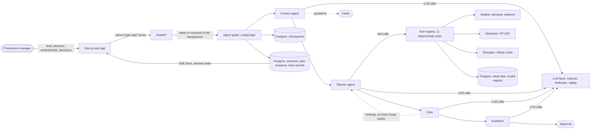
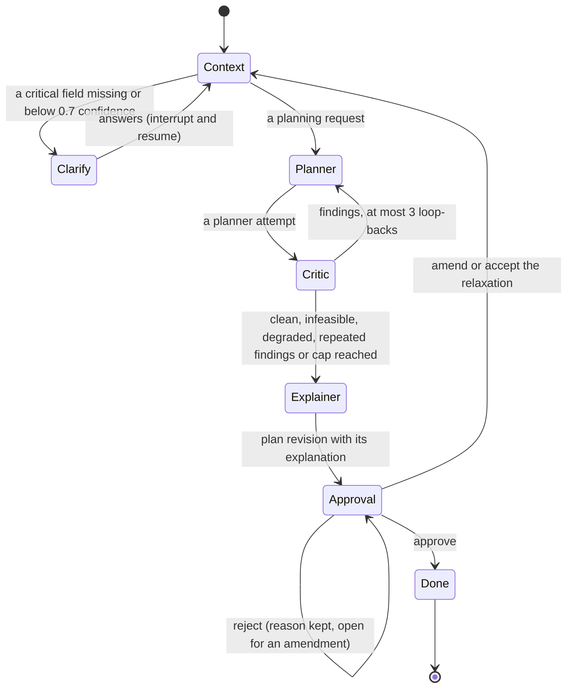

# PromoPilot architecture

This document describes how PromoPilot works as built:

- the process flow;
- the agent graph;
- the tool contracts;
- the models it uses;
- where each feature F-01…F-09 is implemented;
- how the evidence for the F3 × D2 claim is produced.

Terms follow the glossary in [CONTEXT.md](../CONTEXT.md). Every design decision links to its record in [docs/adr/](adr/README.md). [SPEC.md](../SPEC.md) is the original specification, and this document says where the build departs from it.

The claim itself, the SPEC §16 evidence matrix and the eval numbers are in the [nine-blocker document](nine-blocker.md). This document quotes no eval numbers.

## Contents

- [Principle](#principle)
- [Process flow](#process-flow)
- [Components and module boundaries](#components-and-module-boundaries)
- [Agent graph](#agent-graph)
- [Tool contracts](#tool-contracts)
- [Model usage](#model-usage)
- [Feature to implementation](#feature-to-implementation)
- [Evidence for F3 × D2](#evidence-for-f3--d2)
- [Data, time and determinism](#data-time-and-determinism)
- [Robustness, safety and operations](#robustness-safety-and-operations)
- [Decision records](#decision-records)

## Principle

**Agents decide, tools compute, humans approve** ([ADR 0002](adr/0002-agents-decide-tools-compute.md)).

- **Agents decide.** LLM agents read the brief, choose which analyses to run, and weigh trade-offs (for example, answering a competitor versus protecting margin). They also explain the plan.
- **Tools compute.** Every number comes from a deterministic, tested module: demand forecasts, cross effects, candidate promo options, the optimised plan, the simulation and the checks. An LLM never does arithmetic. Numeric grounding checks every number an LLM writes against the tool outputs before a manager sees it.
- **Humans approve.** A plan revision becomes final only when the promotions manager approves it. Before that, they can reject it with a reason, or amend the brief and get a new revision with a diff.

## Process flow

A planning session runs like this:

1. **Brief.** The manager types a brief, or picks one of four example briefs, on the home page. `POST /api/sessions` answers `202` with a session id at once. The agent graph then runs in the background ([ADR 0046](adr/0046-agent-graph-with-checkpointed-approval.md)).
2. **Reading the brief.** The Context agent reads the brief into a planning request with its assumptions, each with a source (brief, data or default) and a confidence ([ADR 0048](adr/0048-context-agent-assumptions-and-clarification.md)).
   - If a critical field is missing, or read below 0.7 confidence, the session pauses at **Clarify** and asks a specific question.
   - `POST /clarify` resumes it from its checkpoint.
3. **Planning.** The Planner agent calls tools to plan. At minimum it calls `generate_candidates` and then `run_optimizer`. The CP-SAT optimiser selects the plan under every constraint. The plan is then simulated ([ADR 0049](adr/0049-llm-planner-agent-with-graceful-degradation.md)).
4. **Checking.** The Critic validates the plan against every hard constraint and reviews its risks. It sends its findings back to the Planner at most 3 times. The best planner attempt becomes the plan revision ([ADR 0051](adr/0051-critic-loop-with-deterministic-risk-review.md)).
5. **Explaining.** The Explainer writes a summary and a rationale per plan line. Every number in them passes numeric grounding, or a template explanation stands in ([ADR 0050](adr/0050-grounded-explainer-with-template-fallback.md)).
6. **Approval.** The session waits at **Approval**. `POST /approve` makes the revision final. `POST /reject` records a reason and keeps the session open. `POST /amend` goes back to the Context agent and plans a new revision with its diff from the previous one ([ADR 0052](adr/0052-amendments-with-revision-diffs.md)). Accepting an infeasible revision's relaxation is an amendment whose values code applies ([ADR 0083](adr/0083-accepted-relaxations-are-applied-in-code.md)).
7. **Watching.** Throughout, every step is a numbered trace event in Postgres. The session page streams them over SSE ([ADR 0047](adr/0047-live-trace-events-over-sse.md)). The same page polls the session for its plan revision ([ADR 0021](adr/0021-session-page-polling-and-plan-display.md)).

The browser never calls the API directly. Next.js route handlers forward every same-origin `/api/*` request unchanged ([ADR 0018](adr/0018-same-origin-api-proxy-paths.md)).

## Components and module boundaries

Everything under `backend/src/promopilot/` is one Python package. The modules below are deep, with small interfaces. No module imports another's private names, and architecture tests in `backend/tests/architecture/` enforce the boundaries.

| Module | What it does | Public interface |
|---|---|---|
| `domain` | Logic-free pydantic value types shared by every module ([ADR 0009](adr/0009-shared-domain-value-types.md)) | `PlanningRequest`, `PlanLine`, `PlanRevision`, `CompanyPolicy`, `Assumption`, … |
| `economics` | Promo economics shared by the optimiser, simulator and oracle ([ADR 0005](adr/0005-single-profit-objective-and-promo-economics.md), [ADR 0011](adr/0011-shared-promo-economics-and-oracle-scoring.md)) | effective price, promo cost, clearance value, margin, incremental profit |
| `datagen` | The seeded synthetic retailer and its hidden ground truth ([ADR 0003](adr/0003-synthetic-data-with-hidden-ground-truth.md)) | `python -m promopilot.datagen` |
| `data` | Postgres schema, loaders and repositories; reads at an as-of week ([ADR 0008](adr/0008-as-of-week-clock.md)) | `RetailData`, `SessionStore`, trace store |
| `models` | Demand model (baseline and promo response), relations model, model registry | `DemandModel.predict`, `relations.fit`, `line_effects`, `python -m promopilot.models` |
| `competitors` | Competitor gaps and the KVI price tolerance ([ADR 0031](adr/0031-competitor-gaps-and-kvi-tolerance.md)) | `CompetitorGaps` |
| `optimizer` | Promo option generation, the CP-SAT solve, binding constraints, relaxation | `generate_options`, `solve`, `relaxed_request` |
| `mechanisms` | Mechanism comparison for one SKU and region ([ADR 0041](adr/0041-mechanism-comparison.md)) | `compare` |
| `simulator` | Seeded Monte Carlo simulation of a plan ([ADR 0042](adr/0042-monte-carlo-simulation-of-plan-revisions.md)) | `simulate` |
| `guardrails` | Deterministic checks: plan validation, risk review, numeric grounding, revision diffs, policy limits ([ADR 0028](adr/0028-guardrails-plan-facts-and-grounding-rules.md)) | `validate_plan`, `review_risks`, `check_numeric_grounding`, `diff_revisions`, `plan_limits` |
| `llm` | The provider protocol, OpenAI and Anthropic providers, replay cassettes, retries, fallback and cost ([ADR 0019](adr/0019-llm-layer-and-cassettes.md), [ADR 0027](adr/0027-resilient-llm-layer.md)) | `LLMProvider`, `ReplayProvider`, `FakeProvider` |
| `agents` | The agent graph, its nodes, prompts, the tool registry and the planning stack | `build_graph`, `planning_stack`, `ToolRegistry` |
| `evals` | Scenario runner, oracle, metrics and report; the only reader of ground truth besides `datagen` ([ADR 0056](adr/0056-eval-runner-and-scenarios.md)) | `python -m promopilot.evals` |
| `api` | FastAPI routers, error schema, rate limits, OpenAPI export | [docs/api.md](api.md) |

The web app in `frontend/` is Next.js (App Router), TypeScript, Tailwind CSS and shadcn/ui, with TanStack Query and Recharts. Its API types are generated from [docs/openapi.json](openapi.json). The pages are:

- `/`: the brief composer;
- `/sessions/[id]`: the planning session;
- `/evals`: the eval dashboard;
- `/models`: the model registry and retrain;
- `/data`: the data explorer.

The tech stack is recorded in [ADR 0001](adr/0001-tech-stack.md).

## Agent graph

The graph is `promopilot.agents.graph.build_graph`. Its state is checkpointed in Postgres after every step, so a session paused at an interrupt resumes after an API restart ([ADR 0046](adr/0046-agent-graph-with-checkpointed-approval.md)).

A test in `backend/tests/architecture/test_architecture_doc.py` fails if this diagram's edges stop matching the compiled graph's.

What each node does:

- **Context agent** (LLM, then code). The LLM only lifts the brief's own phrases and stated numbers. Deterministic code does the rest:
  - it resolves each phrase against the catalogue and calendar, and the match score becomes the assumption's confidence ([ADR 0032](adr/0032-data-tools-as-of-source-and-brief-resolution.md));
  - it fills unstated fields from data and company policy;
  - it flags a brief value that would loosen company policy, and plans at the policy value ([ADR 0007](adr/0007-company-policy-is-tighten-only.md)).

  With every amendment, it reads the brief again, amendments oldest first. If the LLM is unavailable or replay has no cassette, a **fallback reading** by strict rules takes over, and the session asks about whatever those rules cannot read ([ADR 0053](adr/0053-deterministic-context-fallback.md)).
- **Planner agent** (LLM over the tools).
  - It is offered all 11 tools, within at most 8 LLM steps and 16 tool calls per attempt.
  - It decides which analyses to run, such as competitor gaps, relations, inventory or mechanism comparisons. It plans with `generate_candidates` and then `run_optimizer`. The plan is its last successful optimiser result.
  - It may tighten regional caps, the KVI tolerance or the promoted-SKU cap, but never loosen the brief's constraints. To act on a Critic finding about one SKU, it leaves that SKU out with `exclude_sku_ids` ([ADR 0059](adr/0059-critic-loop-converges.md)).
  - A tool that raises is retried, then reaches the planner as a `tool_failed` error.
  - If the LLM is down, or no optimiser plan is reached, the **default sequence** plans instead: generate options, optimise, simulate. The plan's planner note says so ([ADR 0038](adr/0038-sessions-use-the-optimiser.md)).
  - After planning, it checks the scope's KVIs and writes a planner note on each undercut and the plan's response.
- **Critic** (deterministic first, LLM second).
  - `validate_plan` finds every violation of a hard constraint on the plan's own numbers ([ADR 0012](adr/0012-constraint-satisfaction-on-plan-time-values.md)).
  - `review_risks` finds risk findings: over-concentration, heavy cannibalisation and stock-out risk. The LLM only rewords each finding's feedback, and that wording is kept only if it is grounded.
  - The loop stops early when a plan is clean, infeasible or planned by the default sequence, or when an attempt's findings repeat the previous attempt's exactly.
  - The best attempt becomes the plan revision, with its findings as open issues. Best means the fewest violations, then the fewest risk findings within 5% of the best objective, then the highest objective ([ADR 0078](adr/0078-regret-by-cause-and-the-critics-objective-tolerance.md)).
- **Explainer** (LLM, checked). It writes a summary and a rationale per plan line, from tool outputs in which every amount is pre-formatted as it may be cited.
  - `check_numeric_grounding` checks every number. An answer that fails is regenerated once. A second failure, or an LLM error, falls back to a template explanation.
  - For an amended revision, it also says what changed and why, from the deterministic diff.
- **Clarify** and **Approval** are LangGraph interrupts. Approving an infeasible revision is refused. **Done** ends the session.

**Where the build departs from SPEC §9.6.**

- **Clarify is a node.** The Context agent never guesses a critical field.
- **Done is a node.** An approval ends the session, and a rejection keeps it open for an amendment.
- **The Critic caps attempts, not loops.** It counts planner attempts (at most 4) and ends the loop early on repeated findings.
- **Trace events live outside the graph state.** They are stored in `trace_events` and streamed over SSE.

## Tool contracts

The planner agent reaches every number through the tool registry, `promopilot.agents.tools.ToolRegistry` ([ADR 0025](adr/0025-tool-registry-and-estimate-demand.md)).

**What a tool is.** A name, a description, a pydantic input model and output model (whose JSON schemas are what the LLM sees), and an async handler. Its dependencies are bound when the tool is built. The as-of week, company policy, seeds and run counts are never set by the LLM.

**How calls are checked.** `registry.call(name, arguments)` never raises for a bad call. An unknown tool, arguments that break the input schema (an undeclared key included, at any depth), a handler's typed error, and a timeout all come back as a typed `ToolError` that the planner hands back to the LLM ([ADR 0079](adr/0079-briefs-are-data-and-per-client-rate-limits.md), [ADR 0071](adr/0071-one-error-schema-input-limits-and-timeouts.md)).

**Full contracts.** Every field of every input and output schema is in **[docs/tools.md](tools.md)**. It is generated from the registry by `make tool-docs`, and `make test` fails if it drifts ([ADR 0088](adr/0088-readme-for-judges-and-docs-checked-against-code.md)). The tools are listed here in the order the planner agent is offered them.

| Tool | What it returns | Built on | Features |
|---|---|---|---|
| [`estimate_demand`](tools.md#estimate_demand) | Each promo option's units (mean, std), baseline, uplift net of pull-forward, revenue, gross profit, margin, promo cost, incremental profit, per segment | `models.demand` | F-03, F-08 |
| [`get_scope_data`](tools.md#get_scope_data) | Regions with stores, and the category → subcategory → SKU hierarchy with prices and KVI flags | `data` | F-07 |
| [`get_inventory_status`](tools.md#get_inventory_status) | Pooled stock per SKU and region: available stock, days of cover, overstock flag | `data` | F-06 |
| [`get_holidays`](tools.md#get_holidays) | National and regional holidays per region and week, with intensity | `data` | F-07 |
| [`get_competitor_gaps`](tools.md#get_competitor_gaps) | CPI, gap and undercut flag per SKU and region, with the KVI tolerance | `competitors` | F-08 |
| [`get_relations`](tools.md#get_relations) | Substitutes (θ, q-value) and complements (lift, support) | `models.relations` | F-04, F-05 |
| [`generate_candidates`](tools.md#generate_candidates) | A candidate set id and a summary: counts, pruned counts, price matches, best options | `optimizer.generate_options` | F-01…F-08 |
| [`run_optimizer`](tools.md#run_optimizer) | Status, objective, plan lines with why chosen, binding constraints, not-selected options, clearance shortfalls, policy findings, relaxation | `optimizer.solve` | F-01, F-03, F-04, F-06, F-07 |
| [`relax_constraints`](tools.md#relax_constraints) | Whether the request is feasible, and the smallest relaxation if not | `optimizer` | F-06, AG-06 |
| [`compare_mechanisms`](tools.md#compare_mechanisms) | Each mechanism's best option for one SKU and region, ranked by value, with the bundle partner and lift | `mechanisms.compare` | F-02, F-05 |
| [`simulate_plan`](tools.md#simulate_plan) | P10/P50/P90 per plan line and in total, stock-out probabilities, optional competitor reaction | `simulator.simulate` | F-06, F-09 |

`generate_candidates` keeps the full candidate set in process and hands the optimiser only its id ([ADR 0035](adr/0035-promo-option-generation.md)), so the LLM never handles thousands of promo options. Within a session, a Critic loop-back reads its narrowed set off the first one ([ADR 0077](adr/0077-performance-pass-reuses-work-within-a-session.md)).

## Model usage

### Language models

The `llm` layer offers one protocol with two calls, `complete_structured` and `complete_with_tools`. Providers:

- **OpenAI**, default model `gpt-4.1-mini`, run at temperature 0.
- **Anthropic**, default model `claude-sonnet-5`, which takes no sampling parameters.
- **Replay**, which answers from recorded cassettes keyed by request hash and needs no API key. It is the default, and what the demo and CI use.

A live call retries transient errors with backoff, then falls back to the other live provider ([ADR 0027](adr/0027-resilient-llm-layer.md)). Every call's tokens and cost are a trace event, and a session's usage is their sum.

The prompts live in `backend/src/promopilot/agents/prompts/`. A brief, amendment or answer reaches a prompt only as a quoted JSON string, never as instructions ([ADR 0079](adr/0079-briefs-are-data-and-per-client-rate-limits.md)).

| Node | LLM call | Prompt | What the LLM decides | What stays deterministic | Fallback |
|---|---|---|---|---|---|
| Context agent | structured output | `context.md`, `context_amendments.md` | Which phrases and stated numbers the brief contains | Resolution against catalogue and calendar, confidence, policy, questions | Fallback reading by rules ([ADR 0053](adr/0053-deterministic-context-fallback.md)) |
| Planner agent | tool calling | `planner.md` | Which tools to call, in what order, which SKUs to leave out, which constraints to tighten | Every number, the plan (the optimiser's), simulation | Default sequence ([ADR 0049](adr/0049-llm-planner-agent-with-graceful-degradation.md)) |
| Critic | structured output | `critic.md` | The wording of each risk finding's feedback | Violations, risk findings, the route, the best attempt | Template feedback ([ADR 0051](adr/0051-critic-loop-with-deterministic-risk-review.md)) |
| Explainer | structured output | `explainer.md` | The summary, each plan line's rationale and the change explanation | Numeric grounding of every number, the diff | Template explanation ([ADR 0050](adr/0050-grounded-explainer-with-template-fallback.md)) |

### Learned models and solvers

| Model | Method | Where | Decision |
|---|---|---|---|
| Baseline demand | LightGBM on non-promotion weeks with horizon-safe features: lags, seasonality, holidays, store, SKU and competitor index | `models/demand.py`, `models/training.py` | [ADR 0023](adr/0023-baseline-forecast-and-model-registry.md) |
| Promo response | A Poisson GLM per SKU: own-price elasticity per segment, mechanism effects, competitor sensitivity and pull-forward, shrunk toward the subcategory by empirical Bayes, with standard errors | `models/response.py` | [ADR 0024](adr/0024-promo-response-glm-with-empirical-bayes.md) |
| Substitutes | A pooled Poisson GLM cross-price effect θ per within-subcategory pair, kept at Benjamini–Hochberg q < 0.05 and θ ≥ 0.1 | `models/relations.py` | [ADR 0013](adr/0013-substitute-detection-with-fdr-and-effect-size.md), [ADR 0029](adr/0029-relations-pooled-cross-effects-and-basket-lift.md) |
| Complements | Basket lift > 1.5 with minimum support, confirmed by θ < 0 where estimable | `models/relations.py` | [ADR 0029](adr/0029-relations-pooled-cross-effects-and-basket-lift.md) |
| Cannibalisation and halo | Per plan line from the fitted θ, plus exact pairwise terms for promoted substitutes | `models/relations.py` | [ADR 0033](adr/0033-cannibalisation-and-halo-per-plan-line.md) |
| Optimiser | OR-Tools CP-SAT over binary option variables and pairwise substitute variables, in integer paise, on deterministic-time budgets | `optimizer/solver.py`, `optimizer/relaxation.py` | [ADR 0036](adr/0036-cp-sat-optimiser.md), [ADR 0040](adr/0040-clearance-targets-regional-caps-and-kvi-tolerance.md), [ADR 0044](adr/0044-infeasible-requests-and-minimal-relaxation.md), [ADR 0055](adr/0055-deterministic-time-optimiser-budgets.md), [ADR 0080](adr/0080-plan-with-a-safety-margin.md) |
| Simulator | Monte Carlo: response terms drawn from N(estimate, std error), negative binomial demand noise per store, units capped at pooled stock, optional competitor reaction | `simulator/simulate.py` | [ADR 0042](adr/0042-monte-carlo-simulation-of-plan-revisions.md), [ADR 0045](adr/0045-competitor-reaction-in-simulation.md) |

Models are versioned in the Postgres model registry, with their metrics and training date. `make train` and `POST /api/models/retrain` fit and register new versions. The API picks up a new version without a restart ([ADR 0026](adr/0026-models-api-synchronous-retrain.md)).

## Feature to implementation

Paths are under `backend/src/promopilot/`, unless they start with `frontend/`. Tests are under `backend/tests/`.

| Feature | Implementation | Tools | On screen | Tests | Decisions |
|---|---|---|---|---|---|
| **F-01** Select which products to promote | `optimizer/solver.py` `solve`: at most one option per SKU and region, why chosen, not-selected options; `optimizer/options.py` prunes options that would out-sell stock | `generate_candidates`, `run_optimizer` | Plan table, **Not selected** card (`frontend/src/components/plan-table.tsx`, `not-selected-list.tsx`) | `unit/optimizer/test_solve.py`, `test_solve_reports.py`, `test_generate_options.py` | [0035](adr/0035-promo-option-generation.md), [0036](adr/0036-cp-sat-optimiser.md), [0038](adr/0038-sessions-use-the-optimiser.md) |
| **F-02** Determine the promotion mechanism | `mechanisms/compare.py` `compare`; effective prices in `economics/pricing.py`; mechanism effects estimated in `models/response.py` | `compare_mechanisms` | Mechanism drawer (`mechanism-drawer.tsx`) | `unit/mechanisms/test_compare.py`, `unit/agents/test_compare_mechanisms.py` | [0041](adr/0041-mechanism-comparison.md), [0024](adr/0024-promo-response-glm-with-empirical-bayes.md), [0014](adr/0014-clearance-targets-and-bundle-partners.md) |
| **F-03** Optimise the discount and other strategies | Options for each depth, duration, start week and target segment in `optimizer/options.py`; per-segment elasticities in `models/response.py`; the solve in `optimizer/solver.py` | `estimate_demand`, `generate_candidates`, `run_optimizer` | Depth, duration, start and segment columns; uplift by segment in a line's details (`session-details.tsx`) | `unit/models/test_promo_response.py`, `unit/optimizer/test_solve_constraints.py` | [0005](adr/0005-single-profit-objective-and-promo-economics.md), [0006](adr/0006-segment-exclusive-offers.md), [0024](adr/0024-promo-response-glm-with-empirical-bayes.md) |
| **F-04** Understand cannibalisation | Substitutes and `line_effects`, `pairwise_cannibalisations` in `models/relations.py`; pairwise terms and the strong-substitute rule in `optimizer/solver.py` | `get_relations`, `run_optimizer` | Cannibalisation callout (`cross-effect-callouts.tsx`) | `unit/models/test_relations.py`, `test_cross_effects.py`, `unit/optimizer/test_solve_substitutes.py` | [0013](adr/0013-substitute-detection-with-fdr-and-effect-size.md), [0033](adr/0033-cannibalisation-and-halo-per-plan-line.md), [0075](adr/0075-never-promote-strong-substitutes-together.md) |
| **F-05** Understand product relationships | Complements by basket lift and θ, and halo, in `models/relations.py`; BUNDLE partners in `optimizer/options.py` | `get_relations`, `compare_mechanisms` | Halo callout, bundle suggestion in the mechanism drawer | `unit/models/test_relations.py`, `unit/mechanisms/test_compare.py` | [0014](adr/0014-clearance-targets-and-bundle-partners.md), [0029](adr/0029-relations-pooled-cross-effects-and-basket-lift.md), [0033](adr/0033-cannibalisation-and-halo-per-plan-line.md) |
| **F-06** Consider inventory constraints | P90 stock pruning in `optimizer/options.py`; the safety margin (P90 promo cost against the budget, expected units plus 2σ against stock, margin at units' P10) in `optimizer/solver.py` and `guardrails`; clearance targets in two phases in `optimizer/solver.py`; relaxation in `optimizer/relaxation.py`; stock-out probability in `simulator/simulate.py`; the stock check in `guardrails/validation.py` | `get_inventory_status`, `run_optimizer`, `relax_constraints`, `simulate_plan` | Stock-out column, constraint checklist, infeasibility panel (`constraint-checklist.tsx`, `infeasibility-panel.tsx`) | `unit/optimizer/test_solve_relaxation.py`, `unit/guardrails/test_validate_plan.py`, `unit/simulator/test_simulate.py` | [0004](adr/0004-region-level-plan-lines-with-pooled-stock.md), [0014](adr/0014-clearance-targets-and-bundle-partners.md), [0040](adr/0040-clearance-targets-regional-caps-and-kvi-tolerance.md), [0044](adr/0044-infeasible-requests-and-minimal-relaxation.md), [0074](adr/0074-timed-out-plans-are-validated.md), [0080](adr/0080-plan-with-a-safety-margin.md) |
| **F-07** Geographically customise promotions | Plan lines per SKU and region, regional budget caps and per-region clearance in `optimizer/solver.py`; regional demand, stock, segment mix and holidays in `models/demand.py` and `data/` | `get_scope_data`, `get_holidays`, `get_inventory_status` | A tab per region and **Compare regions** side by side (`region-plan-tabs.tsx`) | `unit/optimizer/test_solve_constraints.py`, the regional-holidays eval scenarios | [0004](adr/0004-region-level-plan-lines-with-pooled-stock.md), [0016](adr/0016-synthetic-world-details.md), [0040](adr/0040-clearance-targets-regional-caps-and-kvi-tolerance.md) |
| **F-08** Competitor awareness | `competitors/gaps.py`; competitor index as a demand input in `models/response.py`; price matches in `optimizer/options.py`; KVI tolerance in `optimizer/solver.py`; the undercut planner note in `agents/planner_agent.py` | `get_competitor_gaps`, `estimate_demand` | Competitor card and undercut badge (`competitor-panel.tsx`, `undercut-callout.tsx`) | `unit/competitors/test_competitor_gaps.py`, `unit/agents/test_get_competitor_gaps.py`, the price-war eval scenarios | [0031](adr/0031-competitor-gaps-and-kvi-tolerance.md), [0040](adr/0040-clearance-targets-regional-caps-and-kvi-tolerance.md) |
| **F-09** Simulate the promotion before launching | `simulator/simulate.py` (seeded, vectorised); re-simulation in `api/plans.py` | `simulate_plan` | Simulation card with its P10–P90 band and **Re-simulate** (`simulation-panel.tsx`, `simulation-band-chart.tsx`) | `unit/simulator/test_simulate.py`, `test_simulation_speed.py`, `test_fitted_simulation.py` | [0042](adr/0042-monte-carlo-simulation-of-plan-revisions.md), [0043](adr/0043-re-simulate-the-latest-plan-revision.md), [0045](adr/0045-competitor-reaction-in-simulation.md) |

Agentic capabilities and supporting features:

| Capability | Implementation | Decisions |
|---|---|---|
| **AG-01** Parameter extraction | `agents/context.py`, `agents/assumptions.py`, `agents/resolution.py` | [0048](adr/0048-context-agent-assumptions-and-clarification.md) |
| **AG-02** Clarification | Clarify interrupt in `agents/graph.py`; `POST /clarify` in `api/sessions.py` | [0048](adr/0048-context-agent-assumptions-and-clarification.md), [0061](adr/0061-assumptions-panel-and-clarification-form.md) |
| **AG-03** Tool use | `agents/planner_agent.py` over `agents/tools/` | [0025](adr/0025-tool-registry-and-estimate-demand.md), [0049](adr/0049-llm-planner-agent-with-graceful-degradation.md) |
| **AG-04** Self-correction | `agents/critic.py`, `guardrails/validation.py`, `guardrails/risks.py` | [0051](adr/0051-critic-loop-with-deterministic-risk-review.md), [0059](adr/0059-critic-loop-converges.md), [0078](adr/0078-regret-by-cause-and-the-critics-objective-tolerance.md) |
| **AG-05** Dynamic re-planning | Amend route in `agents/graph.py`, `agents/amendments.py`, `guardrails/diff.py` | [0052](adr/0052-amendments-with-revision-diffs.md), [0083](adr/0083-accepted-relaxations-are-applied-in-code.md) |
| **AG-06** Infeasibility handling | `optimizer/relaxation.py`; the infeasibility panel | [0044](adr/0044-infeasible-requests-and-minimal-relaxation.md), [0067](adr/0067-constraint-checklist-not-selected-and-infeasibility-panel.md), [0074](adr/0074-timed-out-plans-are-validated.md) |
| **SF-01** Observability | `agents/trace.py`, `data/trace.py`, SSE in `api/sessions.py`, JSON logs in `logs.py`; trace timeline and usage meter | [0047](adr/0047-live-trace-events-over-sse.md), [0057](adr/0057-live-session-page-trace-timeline.md), [0085](adr/0085-structured-safe-logging.md) |
| **SF-02** Trainability | `models/training.py`, `models/registry.py`, `api/models.py`; `make train`, **Retrain** on `/models` | [0023](adr/0023-baseline-forecast-and-model-registry.md), [0026](adr/0026-models-api-synchronous-retrain.md) |
| **SF-03** Fault tolerance | `llm/resilience.py` (retries, fallback provider), fallback reading, default sequence, template explanation, checkpoints, timeouts | [0027](adr/0027-resilient-llm-layer.md), [0053](adr/0053-deterministic-context-fallback.md), [0049](adr/0049-llm-planner-agent-with-graceful-degradation.md), [0071](adr/0071-one-error-schema-input-limits-and-timeouts.md) |
| **SF-04** Human oversight | Approval interrupt; decisions and the audit trail in `data/sessions.py` | [0046](adr/0046-agent-graph-with-checkpointed-approval.md), [0066](adr/0066-amend-diff-approve-and-reject.md) |
| **SF-05** Explainability | `agents/explainer.py`, `guardrails/grounding.py`; a source tooltip on every number | [0050](adr/0050-grounded-explainer-with-template-fallback.md), [0060](adr/0060-region-plan-tabs-and-sourced-numbers.md) |

## Evidence for F3 × D2

PromoPilot claims **F3 × D2**. **F3** means all nine features, plus observability, trainability, fault tolerance, human oversight and explainability as supporting features. **D2** means structured tables plus a free-text brief as input, with reliability that is measured rather than asserted (SPEC §2.1). The evidence comes from five mechanisms, and the [nine-blocker document](nine-blocker.md) maps every claim to its code, tests, demo moment and eval metric, with the final numbers.

1. **A world whose truth is known.**
   - `make data` generates a seeded synthetic retailer. Its true demand parameters (elasticities, cross effects, mechanism effects, pull-forward) are written to `data/ground_truth/` ([ADR 0003](adr/0003-synthetic-data-with-hidden-ground-truth.md)).
   - Only `promopilot.datagen` and `promopilot.evals` may read that folder. `backend/tests/architecture/test_ground_truth_boundary.py` enforces the rule. Models and agents therefore learn only from the data, as they would in a real retailer.
2. **An oracle.** `evals/oracle.py` scores any plan on the true demand function, capped at stock. The economics are shared with the optimiser and simulator, so the oracle and the planner count profit the same way ([ADR 0011](adr/0011-shared-promo-economics-and-oracle-scoring.md), [ADR 0017](adr/0017-oracle-attribution-and-stock-cap.md)).
3. **An eval harness over 32 scenarios in SPEC §12.1's nine groups.**
   - `make eval` plays each scenario through the full agent graph and checks each final plan independently of the optimiser. It then scores the plan against two references: a rule-based baseline, and the best plan our own optimiser makes on the true parameters ([ADR 0056](adr/0056-eval-runner-and-scenarios.md), [ADR 0063](adr/0063-plan-quality-baseline-regret-consistency.md), [ADR 0065](adr/0065-scenario-suite-across-the-nine-groups.md)).
   - It measures every SPEC §12.2 metric: constraint satisfaction, oracle breach rate, plan quality, regret (split by cause), consistency, extraction accuracy, clarification behaviour, infeasibility handling, grounding, model recovery, latency and cost ([ADR 0062](adr/0062-agent-behaviour-metrics.md), [ADR 0064](adr/0064-model-recovery-metrics.md), [ADR 0078](adr/0078-regret-by-cause-and-the-critics-objective-tolerance.md)).
   - The `/evals` dashboard shows the latest report.
4. **Tests at every layer.**
   - Property tests on the optimiser's constraints, determinism tests on the simulator, and agent tests driven by `FakeProvider`.
   - API and integration tests against Postgres, and Playwright journeys on the demo stack.
   - Architecture tests: `test_agents_have_no_business_arithmetic.py`, `test_recorded_sessions_are_grounded.py`, `test_domain_is_logic_free.py`, and the diagram test above.
   - No default test calls a real LLM.
5. **Continuous checks.**
   - On every PR, CI replays five smoke scenarios with no key and fails on any session with no plan, broken constraint or cassette miss ([ADR 0069](adr/0069-smoke-eval-in-ci-and-latest-report-api.md)).
   - The `demo` job runs `make demo` from a clean checkout and plays the recorded journeys ([ADR 0073](adr/0073-make-demo-from-a-fresh-clone.md)).
   - Contract jobs keep [docs/api.md](api.md) and [docs/tools.md](tools.md) true to the code.

Each supporting feature is visible in the product:

- **Observability:** the trace timeline and the usage meter.
- **Trainability:** **Retrain** on `/models`.
- **Fault tolerance:** a session planned with no LLM reaches a plan.
- **Human oversight:** the approval gate and the audit trail.
- **Explainability:** a grounded rationale and a source tooltip on every number.

## Data, time and determinism

- **The world.** The seed-42 synthetic Indian retailer has 200 SKUs in 8 categories, and 4 regions of 5 stores, each with its own segment mix. It has a festival calendar on real dates, 104 weeks of history, competitor prices, inventory and baskets ([ADR 0016](adr/0016-synthetic-world-details.md), [ADR 0037](adr/0037-demo-world-promo-economics.md)).
- **The as-of week.** Planning happens at an as-of week. Every time-dependent read excludes history at or after it, so no model or tool sees the future ([ADR 0008](adr/0008-as-of-week-clock.md)).
- **Seeds.** Every stochastic step takes an explicit seed: data generation, training, simulation, the optimiser, and eval scenarios.
- **Solver budgets.** The optimiser's phases stop on CP-SAT deterministic-time budgets, so a request gives the same plan on any machine ([ADR 0055](adr/0055-deterministic-time-optimiser-budgets.md)).
- **Replay.** Replayed LLM calls are keyed by a provider-independent request hash, so a recorded session replays exactly ([ADR 0054](adr/0054-full-graph-session-cassettes.md)).

## Robustness, safety and operations

- **Human in the loop.** Nothing is final without approval. An infeasible revision cannot be approved, and every decision is kept in the audit trail.
- **Grounded numbers.** Numeric grounding checks every number an LLM writes. The architecture test replays every recorded Explainer and Critic answer through it.
- **The brief is data.** Prompts carry it only as quoted data. The tools validate every call on their own. Company policy is tighten-only and applied in code, whatever the LLM asks ([ADR 0007](adr/0007-company-policy-is-tighten-only.md), [ADR 0079](adr/0079-briefs-are-data-and-per-client-rate-limits.md)). Integration tests play prompt-injection briefs against an LLM scripted to obey them.
- **Errors and limits.** Every error has one schema with a reference id. Inputs, request bodies, LLM attempts, tool calls and background runs all have limits and timeouts. Planning and re-simulation are rate-limited per client ([ADR 0071](adr/0071-one-error-schema-input-limits-and-timeouts.md)).
- **Logs.** Logs are JSON lines carrying the request and session ids. Secrets are redacted at every level, and a manager's text appears only at debug level ([ADR 0085](adr/0085-structured-safe-logging.md)).
- **Privacy and fairness.** The data is synthetic, with no personal data. Segments are behavioural, never protected attributes.
- **Scaling.** The API is stateless apart from Postgres. Sessions run as background tasks that are checkpointed after every step. Candidate generation and pairwise pricing are vectorised, and work is reused within a session ([ADR 0077](adr/0077-performance-pass-reuses-work-within-a-session.md)).

## Decision records

- **The ADR index.** Every decision is listed in [docs/adr/README.md](adr/README.md).
- **The founding decisions.** These are the first eleven:
  - [0001: Tech stack](adr/0001-tech-stack.md);
  - [0002: Agents decide, tools compute, humans approve](adr/0002-agents-decide-tools-compute.md);
  - [0003: Synthetic data with hidden ground truth](adr/0003-synthetic-data-with-hidden-ground-truth.md);
  - [0004: Region-level plan lines with pooled stock](adr/0004-region-level-plan-lines-with-pooled-stock.md);
  - [0005: One profit objective](adr/0005-single-profit-objective-and-promo-economics.md);
  - [0006: Segment-exclusive offers](adr/0006-segment-exclusive-offers.md);
  - [0007: Company policy is tighten-only](adr/0007-company-policy-is-tighten-only.md);
  - [0008: The as-of week](adr/0008-as-of-week-clock.md);
  - [0009: Shared domain value types](adr/0009-shared-domain-value-types.md);
  - [0010: Test data from datagen](adr/0010-test-data-from-datagen-with-ground-truth.md);
  - [0011: Shared promo economics and oracle scoring](adr/0011-shared-promo-economics-and-oracle-scoring.md).
- **The vocabulary.** It is in [CONTEXT.md](../CONTEXT.md).
