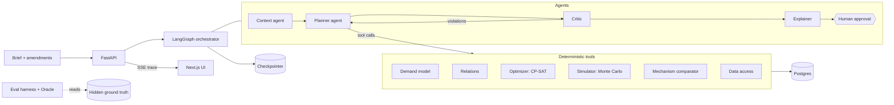

<!--
PITCH DECK DRAFT: 12 slides, SPEC §17. The submission form takes a PDF of at most 50 MB
(SPEC §1.4, §19). This file is the content; you build the PDF.

HOW TO TURN THIS INTO THE PDF DECK
1. Get the screenshots. Either
   a. download the `deck-screenshots` artifact from the latest green run of the CI `demo` job
      (GitHub, Actions, the run, Artifacts) and unzip it into `frontend/screenshots/`, or
   b. run it yourself: `make demo`, then `make screenshots` (Git Bash on Windows). Both give
      the same 1920x1080 PNGs, named as this file refers to them.
2. Fill in every OWNER marker (team, video link, QR code). Resolve every LATE marker (numbers
   that move when #187 lands or a RUNS=5 consistency run is done) and delete the marker. Markers
   are HTML comments in the slides below. Before you export,
   grep -nE "OWN[E]R:|LA[T]E:" docs/deck.md   must print nothing.
3. Export. This file is Marp Markdown (the `---` lines are slide breaks), so:
     npx @marp-team/marp-cli@latest docs/deck.md --pdf --allow-local-files -o PromoPilot-deck.pdf
   or open it in VS Code with the "Marp for VS Code" extension and use "Export slide deck",
   choosing PDF. If you prefer Google Slides or PowerPoint, paste each slide's text and
   drop its images in; the slide order and content are the same.
4. Check: 12 pages, under 50 MB (the images are PNGs; if the PDF is too big, add
   `--image-scale 1` or export the PNGs as JPEG), every number matches
   `backend/evals/published/latest.md` and `docs/nine-blocker.md`.

NUMBERS. Every figure below is from `backend/evals/published/latest.md`: generated
2026-10-01T17:07:27Z, provider `replay` (it replays the recorded live LLM answers), seed-42 world,
33 scenarios x 1 run. The one exception is session time: see slide 10.
CLAIM RULE (ADR 0089, docs/adr/0089-nine-blocker-claim-and-evidence-rules.md, lands with
PR #182): D2 holds when most of the 13 targeted metrics pass and constraint satisfaction,
clarification, infeasibility handling and grounding each pass or miss only narrowly with a
stated cause. Every miss is listed, whichever way the rule falls.
-->

<!-- ============================ SLIDE 1 ============================ -->

# PromoPilot

### An autonomous promotion planner: from a plain-English brief to an approved plan

Retail – Autonomous Promotion Planner (Problem 3) · claiming **F3 × D2**

<!-- OWNER: team name and members, college or company, one line each -->
<!-- OWNER: date and event name -->

- GitHub: `github.com/asalwania/promopilot`
- Demo video: <!-- OWNER: YouTube unlisted link -->

---

<!-- ============================ SLIDE 2 ============================ -->

# 2. Problem statement (Problem 3)

Promotion planning is a coordination problem done in spreadsheets, on gut feel and last year's calendar.

- **Inputs:** inventory · competitor prices · holidays · margins · customer segments
- **Decisions:** which products · how deep a discount · for how long · for whom
- **Constraints:** minimum margin · inventory clearance · marketing budget
- **The hard part:** every choice moves the others. A discount on one SKU pulls sales from its substitutes, lifts its complements, drains stock, invites a competitor reply and eats budget.
- **What was asked:** an agentic planner that extracts or infers its inputs, decides the key dimensions, adjusts as requirements change, and satisfies the parent company's constraints.

---

<!-- ============================ SLIDE 3 ============================ -->

# 3. Proposed solution: brief in, approved plan out

> "Plan Diwali promotions for Snacks and Beverages across North and West. Budget ₹8 lakh. Keep margin above 18%. We are overstocked on 400g namkeen packs — clear at least 60% of that stock. Target families."

1. **Understand.** The Context agent turns the brief into a request, lists every assumption with its source and confidence, and asks when a critical field is missing.
2. **Plan.** The Planner agent chooses its tools: inventory, competitor gaps, demand model, relations, mechanisms, optimiser, simulator.
3. **Check.** The Critic runs deterministic constraint checks and a risk review, and sends findings back to the Planner (at most 3 loops).
4. **Explain.** Every line item gets a rationale, and every number in it is verified against tool output.
5. **Decide.** A human approves or rejects; amendments re-plan with a diff. Approved plans keep a full audit trail.

**Agents decide, tools compute, humans approve.**

---

<!-- ============================ SLIDE 4 ============================ -->

# 4. Nine-blocker claim: F3 × D2

**F3: all 9 features** (F3 needs 7; two are a buffer), plus five supporting features.
Each feature has code, tests, a demo moment and an eval metric: see `docs/nine-blocker.md`.

**D2: structured tables plus a free-text brief, with reliability measured, not asserted.**
Every final plan is scored against the hidden ground truth of a synthetic world that only the eval harness can read.

**Not D3.** Multimodal input (flyers, PDFs) is out of scope; it is on the roadmap.

**Where we stand against the D2 targets (33 scenarios, seed-42 world):**

- **11 of the 13 targeted metrics pass**, including constraint satisfaction 100%, extraction 100%, clarification 100%, infeasibility handling 100%, grounding 100% (39 of 39), elasticity recovery, substitute and complement detection, and plan quality 100%.
- **1 target misses:** Regret 12.3% (target 10%).
- **1 is not measured yet:** Consistency (n/a).

**Why D2 stands.** Our rule (ADR 0089): D2 is kept when most targets pass and the four critical ones (constraint satisfaction, clarification, infeasibility handling, grounding) each pass, or miss only narrowly with a stated cause. All four pass outright. D2 is kept on the strength of the other targets, and the one miss, Regret, is reported with its cause (next slide). If the targets had mostly failed, we would have claimed D1.

<!-- LATE: Consistency is n/a until the live `make eval RUNS=5` run (ADR 0089 D4); then say its number and whether it passes (target 90%), and update "1 is not measured yet" and the 11-of-13 count (12 of 13 if it passes; if it fails it becomes a second miss and the count stays 11). -->

---

<!-- ============================ SLIDE 5 ============================ -->

# 5. Architecture

- The LLM never computes a number. Every number comes from a deterministic, tested tool.
- The graph pauses at **Clarify** and **Approval** (interrupt and resume), and its state is checkpointed in Postgres.
- Full process flow, agent graph and tool contracts: `docs/architecture.md`.

<!-- OWNER: export the mermaid diagram as an image (https://mermaid.live) or paste the diagram from docs/architecture.md; Marp does not draw mermaid by default -->

---

<!-- ============================ SLIDE 6 ============================ -->

# 6. AI models and technologies

| Layer | What we use | What it does |
|---|---|---|
| LLM agents | OpenAI (primary) or Anthropic via `LLM_PROVIDER`, the other as fallback; **`gpt-4.1-mini` recorded the demo sessions**; LangGraph | Understand the brief, choose tools, weigh trade-offs, explain |
| Demand | LightGBM baseline forecast + hierarchical log-log promo response (own-price elasticity per SKU × segment, mechanism effects, competitor sensitivity), with standard errors | Predict units with uncertainty |
| Relations | Cross-price regression with Benjamini–Hochberg control (substitutes); basket lift (complements) | Cannibalisation and halo |
| Optimiser | OR-Tools CP-SAT | Pick at most one promo option per SKU and region under budget, margin, stock and clearance |
| Simulator | Seeded Monte Carlo, 1,000 runs, numpy | P10 / P50 / P90 for every line and the whole plan |
| Platform | FastAPI, Postgres, Next.js, TypeScript strict, Docker, GitHub Actions | One-command demo, SSE trace, typed API |

- **Replay mode:** the demo plays back recorded LLM calls (a `ReplayProvider`), so it runs on a fresh clone with only Docker and no API key. The optimiser and simulator still run live.
- **Seeds everywhere:** data generation, training, simulation and evals are seeded; structured LLM steps run at temperature 0.

---

<!-- ============================ SLIDE 7 ============================ -->

# 7. Feature coverage: all nine

| | Feature | Where you see it |
|---|---|---|
| F-01 | Select products | Plan table + "Not selected" list with reasons |
| F-02 | Mechanism | Mechanism drawer: PCT_OFF, BOGO, BUNDLE, FIXED_PRICE compared |
| F-03 | Discount and strategy | Depth, duration, segment columns; uplift by segment |
| F-04 | Cannibalisation | "Promoting A reduces B's units by N%" callout |
| F-05 | Relationships | Halo and bundle suggestions from complements |
| F-06 | Inventory | Stock-out risk per line; clearance check |
| F-07 | Geography | Region tabs side by side |
| F-08 | Competitor | Competitor panel and the planner's response |
| F-09 | Simulation | P10–P90 band chart, competitor-reaction stress test |

Plus: trace timeline (observability), retrain (trainability), retries and fallback (fault tolerance), approval gate (human oversight), grounded rationales (explainability).

  
  
  

<!-- Image order: F-01, F-02, F-03 / F-04 and F-05 (one callout panel), F-06, F-07 / F-08, F-09, F-01 AC3. 11-cannibalisation-halo-callouts.png is taken only when a recorded plan line carries the callout: if the CI artifact lacks it, use 08 for F-04 and F-05 and drop the image. -->

---

<!-- ============================ SLIDE 8 ============================ -->

# 8. Product demo

The recorded **Diwali demo** brief, end to end, on `make demo` with no API key:

1. Home page: pick the example brief · 2. Live agent trace · 3. Assumptions with confidence · 4. Plan per region · 5. Amend: "Budget cut to ₹6 lakh" → plan revision 2 with a diff · 6. Amend: "Drop West" → plan revision 3 · 7. Approve → final plan with audit trail

  
  

- Video (3:30–4:00): <!-- OWNER: YouTube unlisted link -->
- QR code to the video: <!-- OWNER: QR image, e.g. from any QR generator; place it at the bottom right -->
- Run it yourself: `make demo`, then open http://localhost:3000.

---

<!-- ============================ SLIDE 9 ============================ -->

# 9. Reliability evidence: measured against hidden truth

33 scenarios in 9 groups, scored by an oracle that knows the true demand function. Provider: `replay` (the recorded live answers), seed-42 world, 1 run each, generated 2026-10-01.

| Metric | Result | Target | |
|---|---|---|---|
| Constraint satisfaction | 100.0% (30 of 30) | ≥ 100% | pass |
| Oracle breach rate | 13.3% (4 of 30) | ≤ 15% | pass |
| Extraction accuracy | 100.0% (152 of 152) | ≥ 95% | pass |
| Clarification behaviour | 100.0% (3 of 3) | 100% | pass |
| Infeasibility handling | 100.0% (2 of 2) | 100% | pass |
| Grounding | 100.0% (39 of 39) | ≥ 98% | pass |
| Elasticity recovery (median abs error) | 8.1% | ≤ 20% | pass |
| Substitute precision / recall | 86.7% / 100% | ≥ 80% / ≥ 70% | pass |
| Complement precision / recall | 100% / 97.5% | ≥ 80% / ≥ 70% | pass |
| Plan quality (beats rule-based baseline) | 100.0% (30 of 30) | ≥ 90% | pass |
| **Regret (median vs best plan)** | **12.3% (12 of 29 within 10%)** | ≤ 10% | **miss** |
| Consistency (Jaccard over 5 runs) | n/a | ≥ 90% | not measured |

- **Grounding:** all 39 explanations passed the numeric check; none fell back to the template.
- **Regret miss, with its cause:** of the 17 runs above 10%, **16 are model error** (the demand model over-values the options the optimiser picks), 1 is the planner's choices, 0 are timeouts. By cause the median is: model error 9.1%, planner 0.0%, timeouts 0.0%. One more run was not counted because its best plan was infeasible.
- **Baseline forecast (reported, aim ≤ 25% WAPE):** 13.5% at region × SKU, 25.1% at store × SKU, 43.5% at store × SKU × segment.

 

<!-- LATE: Consistency n/a gets a number from the live `make eval RUNS=5` run; fill the row with its value and its own timestamp (ADR 0089 D4). -->

---

<!-- ============================ SLIDE 10 ============================ -->

# 10. Business impact

Over the 30 scored plans, against the rule-based baseline ("20% off the top 10 sellers"):

- **30 of 30 plans beat the baseline** (target: 90%). The baseline loses money in **22 of 30** scenarios; ours loses in 1.
- **Profit uplift:** the 30 plans earn **₹28.2 lakh** of oracle objective (incremental profit plus clearance value) in total, against **−₹11.1 lakh** for the baseline. Median per scenario: **₹66,540** against **−₹33,885**.
- **Clearance:** the clearance scenarios plan to their stock target without breaking margin; where a target cannot be met (1 of 4), the plan declares it infeasible and proposes the smallest relaxation (infeasibility handling 100%).
- **Constraint breaks:** **zero** in 30 of 30 final plans at plan time (every hard constraint checked by `validate_plan`). Against the hidden truth, 4 of 30 plans (13.3%) break a limit once demand is realised; the target is 15% or less, and plans keep a safety margin by design.
- **Speed and cost:** P50 session **68.3 s** with a live LLM (LLM 36 s, the rest the optimiser and simulator; from the live recording run of 2026-09-30, since the 2026-10-01 report replays recorded answers and its 18.0 s excludes LLM time) and **₹3.52** of LLM cost, against the ₹20 target (token-based, so it holds under replay). SPEC asks for under 60 s for a 2-region × 2-category plan: we are close and over.
- **Planner time saved:** not measured against spreadsheet planning; we claim only the 68 s per plan.

 

<!-- The ₹28.2 lakh and −₹11.1 lakh sums are of the Ours and Rule-based columns of the 2026-10-01 latest.md Plan quality table (30 rows). -->

---

<!-- ============================ SLIDE 11 ============================ -->

# 11. Scalability and responsible AI

- **Per-region scale:** one joint optimiser solve over region-level plan lines with pooled stock; candidate pruning and solver work limits keep it fast; plans are seeded and reproducible.
- **Human approval:** nothing is final until a person approves. A rejection keeps its reason; an infeasible plan cannot be approved.
- **Audit trail:** every amendment, relaxation, approval and rejection is listed, oldest first.
- **Grounding:** every number in an explanation is checked against tool output; a failed check regenerates once, then falls back to a template. **100%** of explanations pass the check today (39 of 39; target 98%).
- **Fault tolerance:** retries with backoff, a fallback LLM provider, deterministic fallbacks (the optimiser runs if the LLM is down), replay mode, checkpointed state.
- **Safe by design:** the brief is data, never instructions; input limits; per-client rate limits; API keys redacted in logs; behavioural segments only; synthetic data, no PII.
- **Assumptions are always visible**, each with its source and confidence.

  

---

<!-- ============================ SLIDE 12 ============================ -->

# 12. Future roadmap

- **Real POS data.** Swap the synthetic world for a retailer's sales, inventory and price feeds; the models, optimiser and eval harness are built to take it.
- **A/B learning loop.** Feed realised promo results back into the elasticity and relation models; this is the direct answer to our regret miss, whose cause is model error (16 of 17 runs above target).
- **Multimodal inputs (D3).** Read competitor flyers, PDFs and images into the same request; today out of scope, which is why we claim D2.
- **Consistency at scale.** Repeat each scenario five times with a live LLM and report plan stability across runs.
- **Deploy.** A hosted instance, so a reviewer needs no Docker.

**Links**

- GitHub: `github.com/asalwania/promopilot`
- Demo video: <!-- OWNER: YouTube unlisted link -->
- Run it: `make demo` (Docker only, no API key)
- Claim and evidence: `docs/nine-blocker.md`
